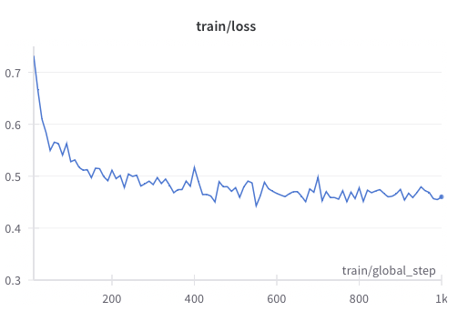
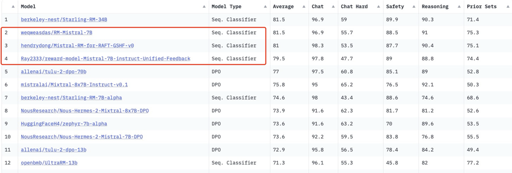

# Reward Modeling Part 1: Bradley-Terry Model

[Wei Xiong](https://weixiongust.github.io/WeiXiongUST/index.html)@UIUC

[Hanze Dong](https://hendrydong.github.io)@Salesforce

[Rui Yang](https://yangrui2015.github.io)@HKUST

*Date: Mar 23, 2024*

**To Readers:**

- Send us an email or raise an [issue](https://github.com/RLHFlow/RLHF-Reward-Modeling/issues) at if you have any questions and enjoy building your own reward models!

**TL; DR**

This is the recipe for the [RLHFlow/RLHF-Reward-Modeling](https://github.com/RLHFlow/RLHF-Reward-Modeling/) repository used to train the reward model for RLHF.

- 8 x A40 48G: we can train Gemma-7B-it/Mistral-7B-inst-v0.2 with max_length 4096 by Deepspeed Zero-3 + Gradient checkpoint;
- 4 x A100 80G: we can train Gemma-7B-it/Mistral-7B-inst-v0.2 with max_length 4096 by Gradient checkpoint;
- The resulting reward models achieve SOTA performance in the RMs with based model ≤ 13B in the leaderboard of [RewardBench](https://huggingface.co/spaces/allenai/reward-bench). They also outperform all existing DPO reward models. (Mar. 23, 2024)

## 1. Introduction

*Reinforcement learning from human feedback (RLHF)* is a leading technique to adapt the generation distribution to be preferred by human and has achieved tremendous success in [ChatGPT](https://openai.com/blog/chatgpt/) by OpenAI, [Claude](https://www.anthropic.com/news/claude-3-family) by Anthropic, and [Gemini](https://arxiv.org/pdf/2312.11805.pdf) by Google. 

The most standard presented in the [Instruct-GPT](https://arxiv.org/pdf/2203.02155.pdf) consists of three steps: 

- Preference data collection;
- Reward modeling;
- Policy optimization.

However, the success of this framework has not been widely reproduced in the open-source community as optimizing the reward function with policy optimization algorithm (e.g. PPO) is extremely unstable and inefficient. 

While there are many works (e.g. the famous [DPO algorithm](https://arxiv.org/abs/2305.18290)) skipping the reward molding by optimizing the preference in a pure <span style="color: purple;">offline manner</span>, the recent work [GSHF](https://arxiv.org/abs/2312.11456) shows that these algorithms can also benefit from reward modeling by fitted into the iterative framework presented in the paper, i.e., the model is trained with DPO, but with preference data labelled by a learned reward. This advancement, however, again necessitates the presence of a high-quality reward model.

Nonetheless, the recipe for training a good reward model in the open-source community is rather limited so far. In view of this, we present this [GitHub repo](https://github.com/WeiXiongUST/RLHF-Reward-Modeling/tree/main) to train the reward model for general preference learning.

## 2. RLHF Basics

### 2.1 Preference

**Initial model:** we assume that we have an initial checkpoint $\pi_0$ that undergoes pre-training and supervised fine-tuning (instruction-following training).

**Preference signal:** distinct from the SFT, where LLM learns from supervised responses, the RLHF aim to learn from *relative feedback.* Formally, for each comparison pair $(x, a^1, a^2)$, the preference oracle satisfies $\mathcal{P}(x,a^1,a^2) = P(a^1 \succ a^2 | x,a^1,a^2) \in [0,1]$, indicating the probability of $a^1$ is preferred over $a^2$ given the prompt $x$ and responses $a^1$ and $a^2$.

**Preference data collection**: we assume that the prompts are sampled from a distribution $d_0$ and we have two behavior policies $(\pi^1, \pi^2)$:

$$
x \sim d_0, (a^1,a^2) \sim (\pi^1,\pi^2), \qquad y \sim \mathrm{Bernoulli}\big(\mathcal{P}(x,a^1,a^2)\big).
$$

where a random preference signal \(y=1\) indicates $a^1$ is better and $y=0$ indicates $a^2$ is better. An example of a preference data is:


```text
Prompt x:

Human: How can I get my girlfriend to cook more?

Assistant: Have you tried reminding her of how nice the food tastes?

Human: I could do it more.

Assistant:

Response:

Chosen $a^1$: That might work. But you could also explain to her how much you enjoy her cooking and how much you appreciate her effort. Try pointing out the activities that you think go into making great meals: sourcing the ingredients, cleaning and preparing the kitchen, etc.

Rejected $a^2$: Have you considered making an effort to create more harmonious interactions?
```


### 2.2 Bradley-Terry Model and Reward Function

[**Bradley-Terry Model](https://en.wikipedia.org/wiki/Bradley–Terry_model): from preference to reward**

The most widely used preference model in practice is the Bradley-Terry model: there exists a scalar function  $r^*(x,a) \in \mathbb{R}$ such that given a prompt $x$ and two responses $a^1, a^2$, the probability of $a^1$ is being preferred is 

$$ 
\mathcal{P}(a^1,a^2,x):= \frac{\exp(r^ * (x,a^1))}{\exp(r^ * (x,a^1)) + \exp(r^ * (x,a^2))} = \sigma\big(r^ * (x,a^1)- r^ * (x,a^2)\big) 
$$


Since the probability of being preferred is positively related to the reward, the goal is transformed to be reward maximization, which can be achieved by many existing deep reinforcement learning (DRL) algorithms. In practice, for training stability and mitigating over-optimization, we usually use the following KL-regularized target:

$$
J(\pi)  = \mathbb{E}_ {x \sim d_0} \left[ \mathbb{E}_ {a \sim \pi(\cdot|x)} [r^ *(x,a)] - \eta \mathrm{KL}(\pi(\cdot|x)\Vert \pi_0(\cdot|x)) \right],
$$

**Reward modeling:** Train a reward function as the maximum likelihood estimation (MLE) of the Bradley-Terry model:

$$
\ell_{\mathcal{D}}(\theta) = \sum_{(x,a^1,a^2,y) \in \mathcal{D}} \log \Big(\sigma\big(r_{\theta}(x,a^1) - r_{\theta}(x,a^2)\big)\Big).
$$

### 3. Dataset Summary

### 3.1 Base Datasets and Statistics

**Base datasets:**

*General Chat:*

- [HH-RLHF](https://huggingface.co/datasets/Anthropic/hh-rlhf)
- [Capybara](https://www.notion.so/argilla/distilabel-capybara-dpo-7k-binarized)
- [Orca](https://www.notion.so/argilla/distilabel-intel-orca-dpo-pairs)
- [SHP](https://huggingface.co/datasets/stanfordnlp/SHP)
- [UltraFeedback](https://huggingface.co/datasets/openbmb/UltraFeedback)
- [HelpSteer](https://huggingface.co/datasets/nvidia/HelpSteer)

*Safe Chat:*

- [PKU-Alignment/PKU-SafeRLHF](https://huggingface.co/datasets/PKU-Alignment/PKU-SafeRLHF)
- [PKU-Alignment/PKU-SafeRLHF-30K](https://huggingface.co/datasets/PKU-Alignment/PKU-SafeRLHF-30K)

We summarize the statistics of these base datasets as follows.

| Dataset HF Name | # Pairs | Average len (chosen, rejected) | Max len | Feedback Mode | Explanation |
| --- | --- | --- | --- | --- | --- |
| Anthropic/hh-rlhf base | 43038 | (202, 188) | 1127 | Human, ranking |  |
| Anthropic/hh-rlhf RS | 51077 | (252, 240) | 1297 | Human, ranking |  |
| Anthropic/hh-rlhf online | 21432 | (416, 421) | 2333 | Human, ranking |  |
| stanfordnlp/SHP; ratio > 2; ver1 | 109526 | (385, 296) | 5115 | Human, ranking | each prompt takes at most 5  pairs |
| stanfordnlp/SHP; ratio > 2; ver2 | 55916 | (388, 292) | 4789 | Human, ranking | each prompt takes at most 1  pairs |
| nvidia/HelpSteer; best v.s. random | 8206 | (772, 732) | 2672 | Human, absolute  | each prompt takes the best v.s. random choice among other samples |
| nvidia/HelpSteer; all pairs | 21576 | (748, 710) | 2672 | Human, absolute |  |
| argilla/ultrafeedback-binarized-preferences-cleaned | 62793 | (541, 447) | 6074 | GPT4, absolute | best v.s. random, use mean score to rank |
| openbmb/UltraFeedback | 267416 | (523, 439) | 6074 | GPT4, absolute | all pairs, delete samples with equal scores, use mean score to rank |
| argilla/distilabel-intel-orca-dpo-pairs | 6405 | (364, 470) | 2279 | GPT4, rank |  |
| argilla/distilabel-capybara-dpo-7k-binarized | 7660 | (1234, 1290) | 5962 | GPT4, rank |  |

### 3.2 Dataset Mixture

In our study, we introduce 4 distinct versions of training set, each composed of different base datasets and pre-processed pairs. Our objective is to explore their influence on the performance of the trained reward models.

**Training sets:**

**Version 1:** The model is trained on a **mixture1** of *General Chat* in **Base datasets**

The total number of the comparison pairs is 250K, where we perform the following data selection and cleaning strategies:

- HH-RLHF: we use all the base, rejection sampling, and online subsets but delete the samples whose chosen == rejected, leading to 115547;
- Capybara: we delete the pairs whose chosen and rejected samples are of the same rating, leading to 7562;
- Orca: we delete the pairs whose chosen and rejected samples are of the same rating, leading to 6405.
- **SHP: we only use the samples with score ratio > 2, for each prompt, we only take 1 comparison, leading to 55916;**
- **Ultrafeedback: similar to [UltraFeedback-Binarized](https://huggingface.co/datasets/argilla/ultrafeedback-binarized-preferences-cleaned), we use the fine-grained score instead of the overall one to rank samples. Meanwhile, for each prompt, we take the best one v.s. random chosen one in the remaining samples. Finally, we delete the selected pairs with equal scores, leading to 62793;**
- **HelpSteer: we use the mean of helpfulness and correctness to rank samples. Meanwhile, we take the best sample v.s. the random chosen one in the remaining samples. Finally, we delete the selected pairs with equal scores, leading to 8206;**

**Version 2:** The model is also trained on a **mixture2** of *General Chat* in **Base datasets**

- HH-RLHF: Same as **Version 1**
- Capybara: Same as **Version 1**
- Orca: Same as **Version 1**
- **SHP: we only use the samples with score ratio > 2, for each prompt, we take 5 comparison at most, leading to 109526;**
- **Ultrafeedback: similar to [UltraFeedback-Binarized](https://huggingface.co/datasets/argilla/ultrafeedback-binarized-preferences-cleaned), we use the fine-grained score instead of the overall one to rank samples. Meanwhile, for each prompt, we take all possible 6 pairs of comparisons. Finally, we delete the selected pairs with equal scores, leading to 267416.**
- **HelpSteer: we use the mean of helpfulness and correctness to rank samples. Meanwhile, we take all possible 6 pairs of comparisons. Finally, we delete the selected pairs with equal scores, leading to 21576;**

**Version 3:** 

**Version 2 +** [PKU-Alignment/PKU-SafeRLHF-30K](https://huggingface.co/datasets/PKU-Alignment/PKU-SafeRLHF-30K) (30K samples)

**Version 4:** 

**Version 2 +** [PKU-Alignment/PKU-SafeRLHF](https://huggingface.co/datasets/PKU-Alignment/PKU-SafeRLHF) (subset 150K samples)

**Discussion:**

The primary goal of **Version 1** and **2** is to examine the effects of pair selection during the data preprocessing phase. **Version 1** adheres to the principle of selecting a single, representative pair for each prompt (e.g., best vs. random), while **Version 2** is designed to offer multiple possible pairs for each prompt. Our findings indicate that **Version 2** generalizes effectively in practical applications and achieves superior performance, attributed to the increased number of pairs. 

Therefore, the development of **Version 3 and 4**  builds upon the foundation established by **Version 2**. Recognizing the absence of a safety component in the *General Chat* pairs, we incorporated an additional dataset that takes safety into account. Specifically, **Version 3** was enhanced with 30,000 samples, while **Version 4** received 150,000 samples (300K samples will dominate the whole training set). Our aim is to explore the balance between general chat functionality and safety considerations.

## 4. Training and Evaluation

### 4.1 Training Setup

**Base Model:**

*Gemma:* Gemma is a family of open-source, state-of-the-art lightweight models developed by Google. The models come in two sizes: 2 billion (Gemma-2B) and 7 billion (Gemma-7B) parameters, offering both base and instruction-tuned variants. It has a context length of 8,000 tokens. We use the instructed model — `google/gemma-2b-it` and `google/gemma-7b-it` as the base model.

*Mistral-7B:* Mistral-7B is a cutting-edge, 7-billion-parameter LLM recognized for its exceptional performance and efficiency across a wide range of benchmarks, notably outperforming models with higher parameter counts such as Llama-2 13B and Llama-1 34B in areas including reasoning, mathematics, and code generation. Its innovative architecture incorporates grouped-query attention (GQA) and sliding window attention (SWA), facilitating faster inference times and efficient handling of long sequences. It has a 4K sliding window context size. We use the instructed model — `mistralai/Mistral-7B-Instruct-v0.2` as the base model.

The training of RM-Mistral-7B on the Version 4 dataset takes about 11 hours with 8xA100 80G. 

We use the the following hyper parameters:

- Gemma-2B-it: batch size 256 and learning rate 1e-5;
- Mistral-7B-Instruct-v0.2: batch size 512 and learning rate 5e-6.
- Training epoch 1;
- Learning rate scheduler: cosine;
- Weight decay: 0.001.

### 4.2 Training Curve and Use the Model

With preference dataset mixture 1, the typical training curve with Gemma-2b-it as the initial model:



We can use the resulting reward model as follows. Please ensure to format the input into the chat template before sending it into the pipeline.

```python
from transformers import AutoTokenizer, pipeline
import torch
rm_tokenizer = AutoTokenizer.from_pretrained("weqweasdas/RM-Mistral-7B")
device = 0 # accelerator.device
rm_pipe = pipeline(
  "sentiment-analysis",
  model="weqweasdas/RM-Mistral-7B",
  #device="auto",
  device=device,
  tokenizer=rm_tokenizer,
  model_kwargs={"torch_dtype": torch.bfloat16}
)

pipe_kwargs = {
  "return_all_scores": True,
  "function_to_apply": "none",
  "batch_size": 1
}

chat = [
{"role": "user", "content": "Hello, how are you?"},
{"role": "assistant", "content": "I'm doing great. How can I help you today?"},
{"role": "user", "content": "I'd like to show off how chat templating works!"},
{"role": "assistant", "content": "Can you explain more?"},
]

test_texts = [rm_tokenizer.apply_chat_template(chat, tokenize=False, add_generation_prompt=False).replace(rm_tokenizer.bos_token, "")]
pipe_outputs = rm_pipe(test_texts, **pipe_kwargs)
rewards = [output[0]["score"] for output in pipe_outputs]
```

### 4.3 Evaluation

[RewardBench](https://huggingface.co/spaces/allenai/reward-bench) introduces a comprehensive framework for assessing various reward models. It also provides all data used in evaluations, including text-score pairs, to facilitate further research into reward model properties. It explores the current state-of-the-art in reward models, examining scaling laws, refusal rates, and reasoning capabilities. Additionally, it points out the shortcomings of current preference data test sets for evaluating these models, particularly their failure to detect nuanced but critical flaws in responses. 

Thus, we choose [RewardBench](https://huggingface.co/spaces/allenai/reward-bench) as our metrics to evaluate the reward models. We have trained a series of reward models, with the evaluation results as follows (note for gemma-2b model, the results are evaluated locally and can be different from the leaderboar. But the comparisons for them are fair due to the same setting).

| Model | Chat | Chat-Hard | Safety | Reasoning |
| --- | --- | --- | --- | --- |
| Gem-2B-Mixture1 | 0.94 | 0.41 | 0.39 | 0.78 |
| Gem-2B-Mixture2 | 0.96 | 0.47 | 0.45 | 0.81 |
| Gem-2B-Mixture2 + Safety 30K; Version 3 | 0.95 | 0.46 | 0.80 | 0.82 |
| Gem-2B-Mixture1 + Safety 150K; Version 4; | 0.95 | 0.44 | 0.80 | 0.70 |

The analysis comparing Mixture 1 and 2 indicates that fully utilizing response pairs is beneficial for overall performance. However, the *General Chat* training set alone does not provide the reward model with adequate understanding of safety distinctions. Incorporating safety data clearly demonstrates that safety preferences can be effectively learned. Nevertheless, an overemphasis on safety data could potentially compromise the model's general capabilities. Maintaining an optimal balance in the safety component is crucial.

Some of the models trained by our script achieve competitive results in the leaderboard of RewardBench, which are state-of-the-art reward models for small-size LLMs (model-size ≤ 13B). The promising results of these reward models can help resource-limited researchers to align better large language models.



## 5. Conclusion and Future Work

In this post, we present a recipe for training reward model with [GitHub repo](https://github.com/WeiXiongUST/RLHF-Reward-Modeling/tree/main), the obtained models achieve state-of-the-art evaluation results on the [RewardBench](https://huggingface.co/spaces/allenai/reward-bench). The resulting reward models can be used for alignment algorithms requiring reward models like [DRL-based RLHF (PPO)](https://arxiv.org/pdf/2203.02155.pdf), and [Iterative SFT (Rejection sampling fine-tuning)](https://arxiv.org/pdf/2304.06767v4.pdf), as well as boosting the performance of the reward-free DPO by turning it into the [iterative DPO](https://arxiv.org/pdf/2312.11456.pdf). 

In the literature, in addition to the Bradley-Terry model, there are also other types of preference modeling, which we leave for future works in the next few weeks. 

**To do**

- [x]  Bradley-Terry Reward Model based on Gemma and Mistral.
- [ ]  Bradley-Terry Reward Model based on Mixtral;
- [ ]  Preference model;
- [ ]  Regression-based reward model;
- [ ]  Multi-objective reward model.

## Citation

The repo was part of the iterative rejection sampling fine-tuning and iterative DPO. If you find the content of this repo useful in your work, please consider cite it as follows:

```latex
@article{dong2023raft,
  title={Raft: Reward ranked finetuning for generative foundation model alignment},
  author={Dong, Hanze and Xiong, Wei and Goyal, Deepanshu and Pan, Rui and Diao, Shizhe and Zhang, Jipeng and Shum, Kashun and Zhang, Tong},
  journal={arXiv preprint arXiv:2304.06767},
  year={2023}
}

@article{xiong2023gibbs,
  title={Gibbs sampling from human feedback: A provable kl-constrained framework for rlhf},
  author={Xiong, Wei and Dong, Hanze and Ye, Chenlu and Zhong, Han and Jiang, Nan and Zhang, Tong},
  journal={arXiv preprint arXiv:2312.11456},
  year={2023}
}
```

## Some Useful Reward Models

We have trained multiple Bradley-Terry reward models and open-sourced them on Huggingface. You can find them by searching the following names:

### Gemma-2B

[RM-Gemma-2B](https://huggingface.co/weqweasdas/RM-Gemma-2B)

[RM-Gemma-2B-Mixture2](https://huggingface.co/weqweasdas/RM-Gemma-2B-Mixture2)

[RM-Gemma-2B-Mixture2-Safety30K](https://huggingface.co/weqweasdas/RM-Gemma-2B-Mixture2-Safety30K)

### Gemma-7B

[RM-Gemma-7B](https://huggingface.co/weqweasdas/RM-Gemma-7B)

### Mistral-7B

[RM-Mistral-7B](https://huggingface.co/weqweasdas/RM-Mistral-7B)

[Mistral-RM-for-RAFT-GSHF-v0](https://huggingface.co/hendrydong/Mistral-RM-for-RAFT-GSHF-v0)

[Mistral-RM-baseline-No-Safety-Alignment](https://huggingface.co/hendrydong/Mistral-RM-baseline-No-Safety-Alignment)

[reward-model-Mistral-7B-instruct-Unified-Feedback](https://huggingface.co/Ray2333/reward-model-Mistral-7B-instruct-Unified-Feedback)

## Acknowledgement

We thank Huggingface for the open-source [TRL project](https://github.com/huggingface/trl), as well as the [Alignment Handbook Project.](https://github.com/huggingface/alignment-handbook/tree/main) We also thank the authors of [RewardBench](https://huggingface.co/spaces/allenai/reward-bench) for their efforts in constructing the first reward benchmark.
