**Authors**

**[Shangmin Guo](https://scholar.google.com/citations?user=cpOrbSoAAAAJ&hl=en)**@University of Edinburgh | [s.guo@ed.ac.uk](mailto:s.guo@ed.ac.uk)

**[Wei Xiong](https://weixiongust.github.io/WeiXiongUST/index.html)**@University of Illinois Urbana-Champaign | [wx13@illinois.edu](mailto:wx13@illinois.edu) 

(Alphabetical order)

_Note: This blog post was originally published at [Notion](https://efficient-unicorn-451.notion.site/Alignment-Guidebook-e5c64df77c0a4b528b7951e87337fa78)._

**Acknowledgements**

Thank [Hanze Dong](https://hendrydong.github.io)@Salesforce, [Tianqi Liu](https://scholar.google.com/citations?user=pUKhiMIAAAAJ&hl=en)@Google, [Wei Shen](https://www.notion.so/Wei-Shen-s-LLM-Blog-dc1c32b03e0e4f84b368dbd09ee9479a?pvs=21)@Ernie code team, [Haoxiang Wang](https://haoxiang-wang.github.io)@UIUC, for insightful feedback on an early draft of this blog.

**To readers:**

- Send email if you feel any part of this article can be improved!

**TL; DR:**

*Reinforcement learning from human feedback (RLHF)* is a leading technique to adapt the outputs of generative models to be preferred by human and has achieved tremendous success in [ChatGPT](https://openai.com/blog/chatgpt/) by OpenAI, [Claude](https://www.anthropic.com/news/claude-3-family) by Anthropic, and [Gemini](https://arxiv.org/pdf/2312.11805.pdf) by Google. Inspired by these successes, *preference optimization* (a slightly more general terminology that also contains the RL-free algorithms) has attracted significant attentions in the past year. In this blog, we aim to present a comprehensive introduction to the *frontier research* in this exciting field, explore the *on-going challenges*, and discuss the interesting *research problems for the future*.

# 1 Prerequisites

## 1.0 Alignment Objective

We start from illustrating the concept of aligning artificial intelligence (AI) systems. Our dicussion largely follows the work, [Artificial Intelligence, Values, and Alignment](https://arxiv.org/abs/2001.09768), by [Iason Gabriel](https://iasongabriel.com/). 

The overall **objective** of AI alignment is to ensure that AI systems act in accordance with human instructions, intentions, values and ethics. The aim is to create AI that not only performs tasks effectively but also understands and aligns with the broader context of human intentions, moral principles, and societal norms. This is crucial as AI technologies become more advanced and autonomous, to prevent unintended consequences and ensure that AI contributes positively to human well-being and societal progress.

<aside>
❗ We hereby emphasize that **alignment is to** **restrict AI behavior to follow human instructions/values/ethics**, is **not to improve the performance** of AI on particular tasks. Or, in another word, alignment is about fine-tuning AI to achieve a specific objective.

</aside>

The specific alignment objectives, however, are still in debate these days, and can vary a lot following different e**thics** or **moral philosophy**, e.g. consequentialism, deontology, and virtue ethics. Below, we list only a few options discussed by Iason.

> Instructions: the agent does what I instruct it to do
> 

> Expressed intentions: the agent does what I intend it to do
> 

> Revealed preferences: the agent does what my behaviour reveals I prefer
> 

> Informed preferences or desires: the agent does what I would want it to do if I were rational and informed
> 

> Interest or well-being: the agent does what is in my interest, or what is best for me, objectively speaking
> 

> Values: the agent does what it morally ought to do, as defined by the individual or society
> 

Since we focus more on the techniques for AI alignment, we skip the details about the above points. But, we highly recomment Iason’s paper, [Artificial Intelligence, Values, and Alignment](https://arxiv.org/abs/2001.09768), and [Paul Christiano](https://ai-alignment.com/@paulfchristiano)’s blogs on [https://ai-alignment.com](https://ai-alignment.com/), for readers who are insterested in the ethical and philosophical discussion about alignment. 

In the following of this blog, we mainly discuss the **techniques to align large language models (LLMs)**.

### Why does alignment come after SFT?

To develop an LLM, there are usulaly three steps. 1) pre-training; 2) supervised/instruction fine-tuning; 3) alignment. More details are introduced in [Section 1.1. below](https://www.notion.so/Alignment-Guidebook-741e816522c64fa58832d76d4bd8e5e0?pvs=21).

We’d like to starting from clarifying the relationship between SFT and alignment. 

Given which ever objective of alignment (among the 6 possibilities from Iason above), for an LLM to be aligned, **a prerequisite is the ability to strictly follow the instructions from users**. So, before we align LLMs towards the preferences/interests/values of humans, the models need to be able to understand and follow the intructions. The most efficient and promising method so far could be SFT.

<aside>
⚠️ PS: we have tried to skip SFT and align a pre-trained only LLM by DPO (a specific alignment algorithm). We found that such a method can improve the instruction following ability of LLMs, but is super inefficient as it took a whole training epoch for the model to understand the task, regardless of whether the model can generate proper responses.

</aside>

## 1.1 Pre-training and Instruction-following Fine-tuning

We summarize the LLM training pipeline as follows.

- **Autoregressive language model** generates one token at a time, and each new token is dependent on the tokens that came before it. For instance, for a sentence $s = [s_1, s_2, \cdots, s_{|s|}]$, the probability is decomposed as
    
    $$
    P(s) = P(s_1) \times P(s_2 |s_1)  \times \underbrace{P(s_3|s_{1:2})}_{\text{Conditioned on the tokens came before}} \times \cdots \times P(s_{|s|}|s_{1:|s|-1})
    $$
    
    Following the convention of the literature, we use $\pi$ to denote the language model in subsequent discussion.
    
- **Pre-training:** the objective of this step is to maximise the likelihood of an unlabelled corpus of $N_1$ sentences $\{s^i\}_{i=1}^{N_1}$, usually through minimizing the following negative log-likelihood (NLL) objective
    
    $$
    \min_{\pi} \mathcal{L}(\pi) = - \sum_{i=1}^{N_1} \underbrace{\sum_{j=1}^{|s^i|} \log \pi(s_j^i|s^i_{1:j-1})}_{\text{log-likelihood of one sentence for the autoregressive model}}. 
    $$
    
    Intuitively, pre-training is for LLMs to fit on the universal distribution over human languages and obtain the ``knowledge'' implied in that distribution.
    
- **Supervised/Instruction-following Fine-tuning:** after the pre-training, an LLM is then fine-tuned on a collection of $N_2 (N_2 \ll N_1)$ prompts $\{x\}$ along with their labelled responses $\{a\}$ from human labller through minimizing the following NLL objective:
    
    $$
    \min_{\pi} \mathcal{L}(\pi) -\sum_{i=1}^{N_2} \underbrace{\sum_{j=1}^{a^i} \log \pi(a_j^i| a_{1:j-1}^i, x^i)}_{\text{log-likelihood of one completion for the autoregressive model.}}.
    $$
    
    where $\pi$ is initialized as a copy of the pre-trained model. Intuitively, this step is to teach the model to [follow the instructions from the humans.](https://arxiv.org/pdf/2109.01652.pdf)
    
- **Alignment (Preference Optimization):** after SFT, the last step before deploying the LLM is the RLHF. **In short, preference optimization is the leading technique to adapt the output generation to be aligned towards human values and is a key component to make Chat-GPT from GPT-3.**
    
    The classic RL-based preference optimization (known as *reinforcement learning from human feedback, RLHF*) is first developed in [Christiano et. al. 2017](https://arxiv.org/abs/1706.03741) and [Stiennon et. al. 2020](https://arxiv.org/abs/2009.01325), and then further developed by the [Instruct-GPT](https://arxiv.org/abs/2203.02155) and [Claude](https://arxiv.org/abs/2204.05862). Recently, another line of works focused on designing RL-free algorithms that directly optimize LLMs with human preferences. 
    
    By whichever way, the core idea behind the alignment is to learn ``human value functions'' from the preference data, so we'll refer this step as ``**preference optimization**'' in the following content. 
    

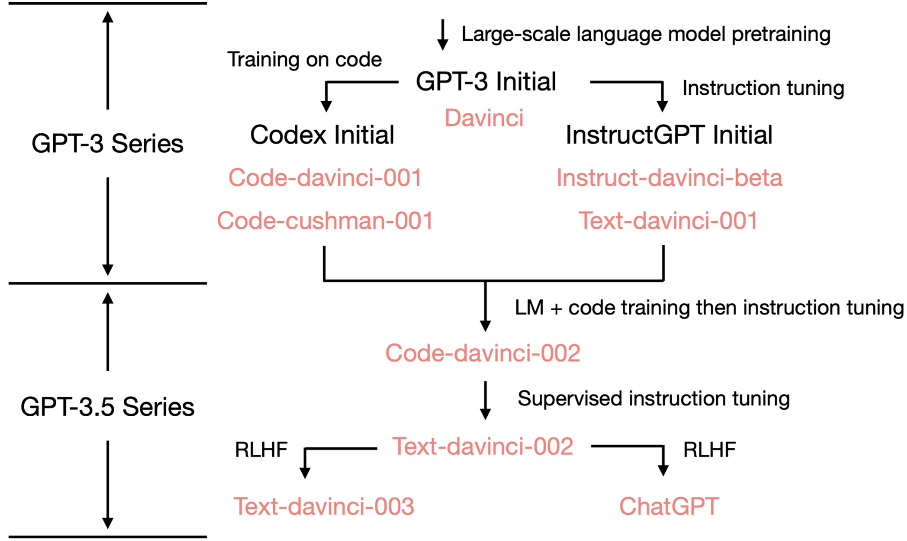

(The figure is borrowed from [Yao Fu's blog](https://www.notion.so/b9a57ac0fcf74f30a1ab9e3e36fa1dc1?pvs=21))

### Why isn’t supervised/instruction-finetuning sufficient to achieve alignment?

Another natural question about supervsed/instruction-finetuning (SFT) and alignment is about whether SFT alone can achieve the aligment objective. We hereby provide some pilot results from a [stand-alone blog of ours](https://github.com/LLaMafia/SFT_function_learning) to support that SFT alone might not be sufficient to align LLMs. 

Our key hypothesis is:

Given a set of samples $\mathbb{D}=\{(x_i,y_i)\}_{i=1}^N$ **generated by a target function *$f_{tgt}$*, if we train a model $\pi$ on $\mathbb{D}$, $\pi$ is not neccessarily learning $f_{tgt}$. Instead. $\pi$ might learn a simpler function $f_{smp}$ that can generate $\mathbb{D}$ as well.

To verify the above hypothesis, given a prompt $x_i$ and the corresponding learning target $y_i^+$, we then generate the following kinds of responses to the same prompt $x_i$:

1. **Rejected response $y_i^-$**: a response that is sampled from $f_{tgt}(x_i)$ as well, but is less preferred by humans, compared to $y_i^+$.
2. **Paraphrase of rejected response $\tilde{y}_i^-$**: a paraphrase of the *REJECTED* response $y_i^-$, done by Gemini-Pro.
3. **Variant response $y_i'$**: a responses generated by Gemini-Pro to $x_i$, thus $y_i'\in\mathbb{D}$ but should be *out of the distribution* specified by $f_{tgt}(x_i)$.
4. **Random response $y_j^+$**: the preferered response to a randomly selected prompt $x_j$.
N.B. the index is $j$ here instead of $i$, thus $y_j^+\in\mathbb{D}$ but is mapped from a different $x_j$.
$y_j^+$ should be totally out of the distribution specified by $f_{tgt}(x_i)$.
5. **Non-response $\bar{y}_i$**: a random sentence generated by Gemini-Pro, thus not a response, i.e. $\bar{y}_i\notin\mathbb{D}$.

Now, let's see how the likelihood of the above kinds of responses change over SFT. The model $\pi$ is [Pythia-2.8b](https://huggingface.co/EleutherAI/pythia-2.8b).
N.B. the learning target is **ONLY** the "SFT target" $y_i^+$!

In short, we observed the following three ponts:

- All log-probabilities $\log \pi(\cdot|x_i)$ increased over SFT except for the "non-response" $\bar{y}_i$.
- Log-probability of different kinds of responses increase in different degrees.
    - The increamental of log-probability from high to low is: $\Delta\log \pi(y_i^+|x_i)$$> \Delta\log \pi(y_i^-|x_i)$$>\Delta\log \pi(y_j^+|x_i)$$>\Delta\log \pi(\tilde{y}_i^-|x_i)$$>\Delta\log \pi(y_i'|x_i)$$>\Delta\log \pi(\bar{y}_i|x_i)$.
- Log-probability of "rejected responses" $\log \pi(y_i^-|x_i)$ is always higher than that of the "proper responses" $\log \pi(y_i^+|x_i)$.

The results above suggest that SFT is actually learning to generate "responses" in general, not even only the "responses" to $x_i$, since $y_j^+$ also increases. More interestingly, the log-probability of "rejected responses" $y_i^-$ is alway higher than that of the "proper responses" $y_i^+$, which suggests that **only SFT cannot achieve alignment of LLMs**.

<aside>
⚠️ We ran the above experiment in a limited scale, whehter the above conclusion holds more generally remains exploration. If you’re intereted in digging deeper, feel free to contact us and we’re happy to collaborate on exploring this question!

</aside>

## 1.2 Preference Data Collection, Reward, and Bradley-Terry Model

We formally define some useful notions and concepts used for the subsequent discussion.

- **Initial model:** we assume that we have an initial checkpoint $\pi_0$ that undergoes pre-training and supervised finetuning (instruction-following training).
- **Preference signal:** distinct from the SFT, where we learn from labeled data, the RLHF learns from *relative feedback.* Formally, for each comparison pair $(x, a^1, a^2)$, the preference oracle satisfies $\mathcal{P}(x,a^1,a^2) = P(a^1 \succ a^2 | x) \in [0,1]$, indicating the probability of $a^1$ is preferred over $a^2$ given the prompt $x$.
- **Preference data collection**: we assume that the prompts are sampled from a distribution $d_0$ and we have two behavior policies $(\pi^1, \pi^2)$:
    
    $$
    x \sim d_0, (a^1,a^2) \sim (\pi^1,\pi^2), \qquad y \sim \mathrm{Bernoulli}\big(\mathcal{P}(x,a^1,a^2)\big).
    $$
    
    where a random preference signal $y=1$ indicates $a^1$ is better and $y=0$ indicates $a^2$ is better. 
    

We summarize the three learning stages of LLM as follows. 

|  | data format | learning objective |
| --- | --- | --- |
| Pre-training | a large amount of unlabelled data | fit on the universal distribution over human languages and obtain knowledge. |
| SFT | a collection of prompt-response pair $(x, a)$ | improves model’s ability to follow instructions |
| Preference optimization | $(x,a^+,a^-)$ and $a^+$ is better than $a^-$. | align the models towards specified human values/intentions/expectations |

[**Bradley-Terry Model](https://en.wikipedia.org/wiki/Bradley–Terry_model): alignment to reward model**

The most widely used preference model in practice is the Bradley Terry model, which assumes that there exists a ground truth reward function $r^*(x,a) \in \mathbb{R}$ such that given a prompt $x$ and two responses $a^1, a^2$, the probability of $a^1$ is being preferred is 

$$
\mathcal{P}(a^1,a^2,x):= P(a^1\succ a^2|x)= \frac{\exp(r^*(x,a^1))}{\exp(r^*(x,a^1)) + \exp(r^*(x,a^2))} = \sigma\big(r^*(x,a^1)- r^*(x,a^2)\big),
$$

where $\sigma(z) = 1/(1+\exp(-z))$ is the sigmoid function. Then, the goal is to update the initial $\pi_0$ to bias toward high-rewards responses. The common goal used in practice is to get a new policy that has high expected reward, while still stays close to the initial model (so that the knowledge from pre-trained and SFT stages is preserved). To this end, in practice, we usually use the following KL-regularized target:

$$
J(\pi)=\mathbb{E}_{x \sim d_0} \mathbb{E}_{a \sim \pi(\cdot|x)}\left[ r^*(x,a) + \eta \log \frac{\pi_0(a|x)}{\pi(a|x)}\right]    = \mathbb{E}_{x \sim d_0} \left[ \underbrace{\mathbb{E}_{a \sim \pi(\cdot|x)}[r^*(x,a)]}_{\text{Reward maximization}} - \eta \underbrace{\mathrm{KL}(\pi(\cdot|x)\Vert \pi_0(\cdot|x))}_{\text{Stay close to initial model}}\right],
$$

Two main motivations for adding an additional regularization KL term.

- The reward function $r^*$ can differ from the real-world user experience because the BT model may not fully capture the complicated preference. In this case, imposing heavy optimization pressure on reward maximization can lead to reward hacking, meaning that the model will exploit the weakness of the imperfect reward models, leading to a high reward but a poor real-world performance.
- Even the BT model can capture the human preference, the reward-maximizer will converge to some ``optimal'' response and is deterministic. The KL term can guarantee the solution is randomized and the diversity of responses is beneficial in real applications. The $\eta$ may reflect our confidence toward the reward function.
- The KL regularization helps to improve training stability.

## 1.3 On/off-policy and On/off-line Learning in the Context of Alignment

Before diving into the details of RL-based and RL-free alignment algorithms, we’d like to first clarify the definition of the following key concepts and give some examples of them along with them.

- **On-policy learning:** the learning of $\pi_t$ is on-policy, if $a_i\sim\pi_t(\cdot|x_i)$. That is, the responses are sampled from $\pi_t$ with $x_i$ as inputs.
- **Off-policy learning:** the learning of $\pi_t$ is off-policy, if $a_i\not\sim \pi_t(\cdot|x_i)$. That is, the responses are not following the distirubtion specified by $\pi_t$ with $x_i$ as inputs.

<aside>
❗ The following methods may lead to not strictly on-policy learning: 1) increasing sampling temperature; and 2) rejectiong sampling with best-of-n to ajust the distribution of $a_i$. However, in both cases, the distribution shift is limited/bounded, particularly for 2).

</aside>

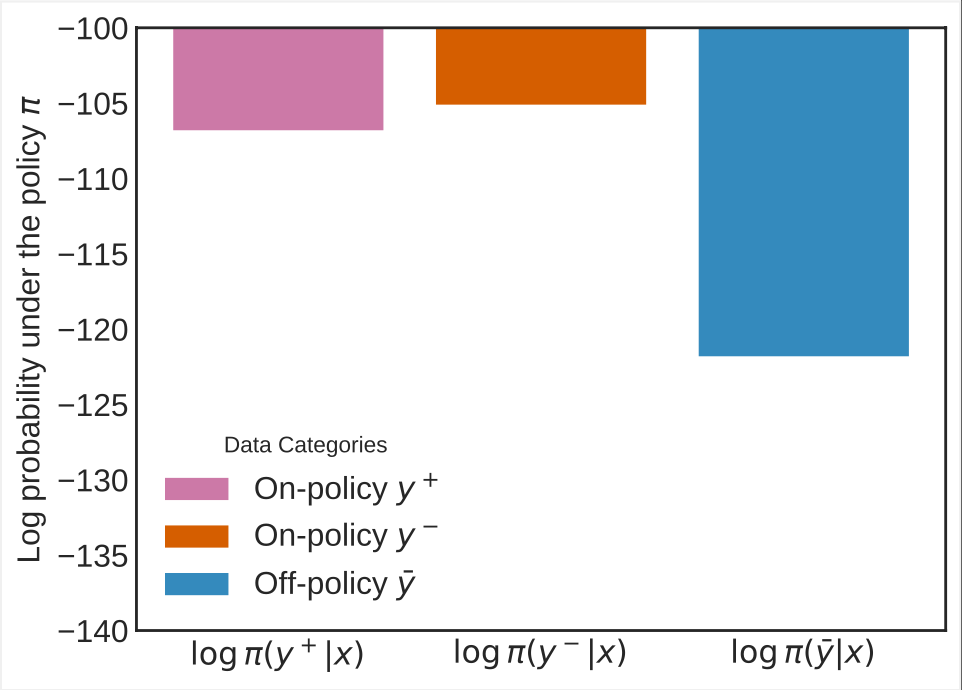
An illustration of the distribution shift issue in preference dataset collection.

- **Online learning:** the learning of $\pi_t$ is online, if the preference oracle $\mathcal{P}(x,a^1,a^2)$ or its approximator $\hat{\mathcal{P}}(x,a^1,a^2)$ can be queried over training. According to the frequency of querying the (approximated) preference oracle, the online learning algorighms can be further catogerised as follows.
    - Squential/fully/batch-wise online: $\mathcal{P}(x,a^1,a^2)$ or $\hat{\mathcal{P}}(x,a^1,a^2)$ is queried for every batch.
    - Iterative online: $\mathcal{P}(x,a^1,a^2)$ or $\hat{\mathcal{P}}(x,a^1,a^2)$ is queried once every $T$ batches.
    - Hybrid online:  start with an offline dataset (e.g. all the open-source preference datasets) but include online exploration in the following training.
- **Offline learning:** the learning of $\pi_t$ is offline, if $\mathcal{P}(x,a^1,a^2)$ or  $\hat{\mathcal{P}}(x,a^1,a^2)$ can only be queried ahead of training.

In pratice, the two dimensions above (on/off-policy and on/offline) are usually NOT orthogonal. Thus, we showcase several alignment methods following the categories defined above, to further clarify these concepts.

1. PPO with a fixed reward model: on-policy but offline (sampling responses from $\pi_t$ → on-policy, a fixed reward model → offline).
2. PPO with a separate reward model for each $\pi_t$: on-policy and online (because a new reward model is trained by querying $\mathcal{P}(x,a^1,a^2)$  nor $\hat{\mathcal{P}}(x,a^1,a^2)$ to label samples from $\pi_t$).
3. (Vanilla) DPO on a fixed and pre-collected dataset: off-policy and offline (responses pre-collected from other LLM → off-policy, preferences were pre-annotated and fixed → offline).
4. Iterative rejection sampling finetuing with a fixed reward model: on-policy but offline (same as case 1).
5. Iterated online RLHF: on-policy and iterative online (as suggested by the name).
6. Iterative DPO: on-policy and iterative online (as suggestd by the name).
7. Online DPO: on-policy and (fully) online (as $\hat{\mathcal{P}}(x,a^1,a^2)$ is queried for every batch).

<aside>
⚠️ All methods with a reward model trained at once: offline, since the reward model will score the responses, and the model won’t query either $\mathcal{P}(x,a^1,a^2)$ or $\hat{\mathcal{P}}(x,a^1,a^2)$ over training.

</aside>

<aside>
⚠️ All off-policy methods (so far) imply offline learning: we can always generate on-policy responses given a policy being trained, so it doesn’t make sense when we have accessible $\mathcal{P}(x,a^1,a^2)$ or $\hat{\mathcal{P}}(x,a^1,a^2)$ but don’t use them to annotate preference over on-policy responses.

</aside>

---

# 2 RLHF: The Classic Framework to Make ChatGPT

## 2.1 Instruct-GPT: a Three-stages Approach

The most standard RLHF framework is first popularized [in 2017](https://arxiv.org/pdf/1706.03741.pdf) and achieved tremendous successes in subsequent applications like [Instruct-GPT](https://arxiv.org/pdf/2203.02155.pdf), and [Claude](https://arxiv.org/pdf/2204.05862.pdf). The classic framework presented in the [Instruct-GPT](https://arxiv.org/pdf/2203.02155.pdf) consists of three steps:

**Step 1 Preference data collection:** collect comparison dataset $\mathcal{D}$ using a behavior policy pair $\pi_1, \pi_2$

$$
x \sim d_0, (a^1,a^2) \sim (\pi^1,\pi^2), \qquad y \sim \mathrm{Bernoulli} \big(\mathcal{P}(x,a^1,a^2)\big).
$$

**Step 2 Reward modeling:** Train a reward function as the maximum likelihood estimation (MLE) of the Bradley-Terry model.

$$
\ell_{\mathcal{D}}(\theta) = \sum_{(x,a^1,a^2,y) \in \mathcal{D}} \log \Big(\sigma\big(r_{\theta}(x,a^1) - r_{\theta}(x,a^2)\big)\Big).
$$

**Step 3 Policy optimization:** optimize the policy using [PPO](https://arxiv.org/pdf/1707.06347.pdf) with the regularized reward:

$$
\pi_r(a|x) := \arg\max_{\pi}\left[ r(x,a) - \eta \log \frac{\pi(a|x)}{\pi_0(a|x)}\right]
$$

**Offline and Online RLHF, terminology that differs from the RL literature**

The framework is referred to as an **offline** one because we do not further query the oracle $\mathcal{P}(\cdot)$ along the way. In other words, **the key difference between an offline algorithm and an online one is whether we query the preference oracle $\mathcal{P}(\cdot)$ along the way, instead of generating new responses.** In this sense, **PPO with a fixed reward model is an offline algorithm.**

Usually, the behavior policy is exactly $\pi_0$. Then, the constructed reward model $r$ is accurate to evaluate the generation from $\pi_0$. We may expect the reward model $r$ to generalize well beyond the distribution of $\pi_0$ in the face of the distribution shift along the way of PPO training. Unfortunately, this is not true in general, as demonstrated in [``Scaling Laws for Reward Model Overoptimization''](https://arxiv.org/pdf/2210.10760.pdf). 

Here, the Gold reward $r^*$ (the solid line) is a 7B reward model set as the $\mathcal{P}$ to label data. The proxy-RM $r$ (the dotted line) is the reward model trained from an offline dataset collected by $\pi_0$ and labeled by $r^*$. As we can see, at the initial stage, both the proxy and gold reward increase, meaning that the proxy reward $r$ is accurate and aligns with the gold reward well. However, as KL divergence increases, meaning that the distribution shift becomes serious, the proxy reward keeps increasing but the gold reward decreases. 

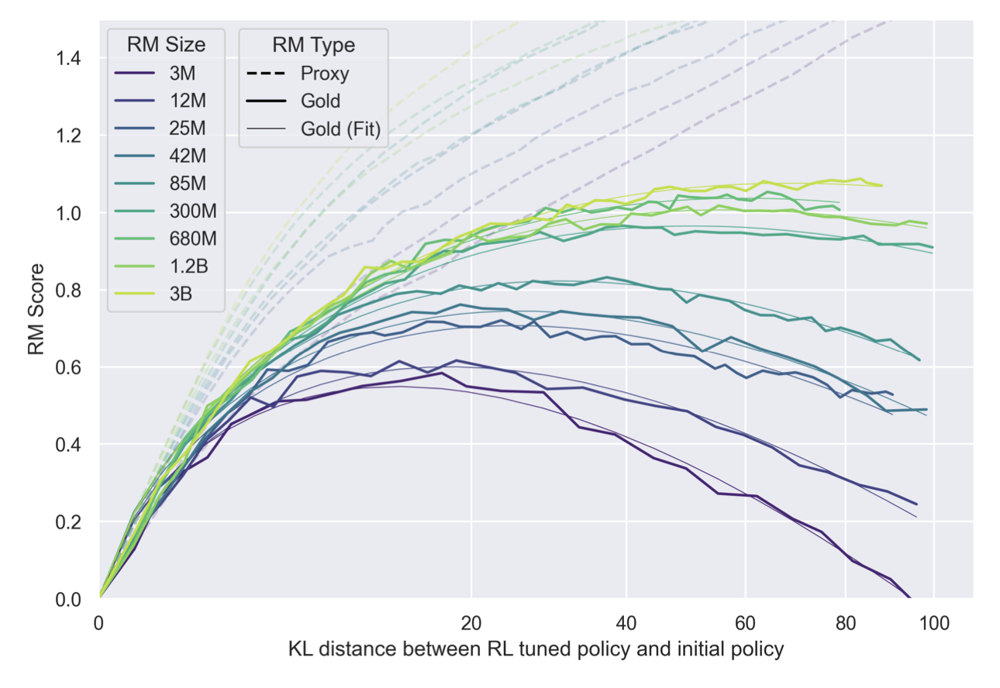

In most of the existing literature, the RLHF algorithms easily move far away from the initial model so that the KL divergence is larger than $20$, meaning that there exists a significant distribution shift along the way of preference learning:

$$
\left|\frac{\pi_t(\cdot|x)}{\pi_0(\cdot|x)}\right|_\infty \geq \exp\big(20).
$$

 See [Figure 13](https://arxiv.org/pdf/2204.05862.pdf) for PPO, [Figure 4](https://arxiv.org/pdf/2312.11456.pdf) for DPO, and [Figure 3](https://arxiv.org/pdf/2304.06767v4.pdf) for rejection sampling finetuning. 

<aside>
❗ **Take-away message: offline** RLHF suffers from the **distribution shift** issue, and the reward generalizes poorly to the out-of-distribution samples (**especially the samples with high rewards)**. Accordingly, when designing RL algorithms to maximize these trained reward models, we must take this factor into consideration.

</aside>

We mention in passing that it is natural to see that the reward model may not generalize well because reward model is fine-tuned from some base pretrained model and  [``finetuning typically improves in-distribution generalization, but often performs poorly out-of-distribution, sometimes even degrading performance relative to zero-shot prompting''](https://arxiv.org/pdf/2312.09390.pdf) . 

## 2.2 Online Iterative RLHF

We resort to the [Claude](https://arxiv.org/pdf/2204.05862.pdf) project to illustrate the online iterative RLHF as it contains much more details compared to the Instruct-GPT. Starting from scratch, it proceeds as follows

- **Step 1 policy training:** we train the best RLHF policy we can using all the historical data;
- **Step 2 data collection:** we use the obtained policy to collect new comparison responses and ask the human to label them; the new comparison data is then mixed with all the historical data;
- **Step 3 reward modeling and  policy optimization:** we then train a reward based on new mixture of data and train a new RLHF policy. Then reiterate this process indefinitely.

We remark that the framework (and its variants) is also adopted in Instruct-GPT and [LLaMA2 project.](https://arxiv.org/pdf/2307.09288.pdf) Here the terminology **iterative** stresses on a trade-off between the training cost and oracle query frequency, as compared to the fully online setting where all the signals are provided by the humans. It is possible that when the human data is collected in a high frequency, the KL regularization is less important. In contrast, with a sparse update and iterations with the human, it is critical to impose sufficient regularization. For instance, since most of the data for the instruct-GPT is sampled from $\pi_0$,  with some coming from the intermediate checkpoints, the instruct-GPT project further adopts a replay-loss with the pretrained data distribution, and find the optimal KL coefficient is about $0.02$. On the other hand, the [Claude project](https://arxiv.org/pdf/2204.05862.pdf) seems to interact with the humans much more frequently and a much smaller KL coefficient of $0.001$ is used.

We summarize some important aspects as follows.

- **Motivation**: the main motivation for adopting such an online framework is that the online RLHF policy can help to collect data on the upper end of the reward distribution, which can hardly be sampled from $\pi_0$. Then, the new data helps to improve reward estimation for the samples from the high-reward regime, thus allowing us to train even better policies.
- **Exploration Strategy** since RLHF policy tends to lose output diversity, it is crucial to include certain exploration strategy in step 2 to improve the diversity of data collected through the online process.
- **Hybrid Variant** LLaMA2 includes the open-source offline preference datasets in their initial data mixture and keeps them throughout the online RLHF process: [they could enable better generalization for the reward model and prevent reward hacking.](https://arxiv.org/pdf/2307.09288.pdf)
- **Training Restart** Claude restarts from $\pi_0$ when training each new RLHF policy, instead of training the same model iteratively. It is not clear whether Instruct-GPT and LLaMA2 adopt the same strategy. Notice that we use all the historical data in each iteration. In this case, restarting from $\pi_0$ may be helpful for mitigating over-optimization and reward hacking without degenerating the model performance.

A summarization and comparison of the Claude and LLaMA2 frameworks.:

|  | Initial data | Exploration in step 2 | Reward Optimization |
| --- | --- | --- | --- |
| https://arxiv.org/abs/2204.05862 | $\pi_0$ and rejection sampling | models saved in different training steps and iterations | PPO |
| https://arxiv.org/abs/2307.09288 | $\pi_0$ and offline open-source data | different model variants, with varied sampling temperature. | Rejection Sampling Finetuning + PPO |
| Iterative DPO | - | rejection sampling: best-of-n v.s. worst-of-n.  | DPO (See next section) |

---

# 3 RL-Free framework: SLiC, DPO, IPO, and More

While the DRL-based (PPO) RLHF framework achieves tremendous success in Chat-GPT, the RL step in RLHF is memory-intensive as it requires loading 4 models at the same time:

- The LLM policy to be aligned, i.e. the actor in PPO;
- The reward model;
- The critic in PPO, which is usually initialized as the reward model;
- The reference model to compute KL.

More importantly, tuning the PPO to its best performance is challenging due to the training stability issue and sample efficiency. The successes of the strong closed-source LLMs have not been widely reproduced so far. In view of this, researchers have made efforts to design more stable and efficient algorithms as the alternative approach to the PPO, particularly focusing on the RL-free algorithms.

## 3.1 [Direct Preference Optimization (DPO) and Online Variants](https://arxiv.org/pdf/2305.18290.pdf)

The first RL-free alignment algorithm we’re going to introduce naturally follows the RLHF framework, the DPO algorithm introduced by [Rafailov et al. (2023)](https://arxiv.org/pdf/2305.18290.pdf). The key inspiration for DPO is a closed-form solution to the RL step in RLHF, and thus an equivalent solution to the optimal policy for RLHF objective.

### Derivation of the DPO Objective Function Following RLHF

Let’s start from how the DPO objective is derived from the RLHF framework. The equivalence between the solution to RLHF and DPO objectives relies on the following two propositions.

**Proposition 1** For any reward function $r$, the KL-constrained optimization admits the following closed-form solution:

$$
\pi^*_r(a|x):=\argmax_{\pi} \mathbb{E}_{x \sim d_0} \left[ \mathbb{E}_{a \sim \pi(\cdot|x)}[r(x,a)] - \eta \mathrm{KL}(\pi(\cdot|x)\Vert \pi_0(\cdot|x)) \right] = \frac{1}{Z(x)} \pi_0(a|x) \exp( \frac{1}{\eta}r(x,a)),
$$

where $Z(x)= \sum_{a'} \pi_0(a'|x) \exp( \frac{1}{\eta}r(x,a'))$ is the normalization constant and cannot be directly computed since the action space (all possible responses) is exponentially many in terms of the length. Using this proposition, we can connect the reward with the policy by $r \to \pi_r$. In particular, taking log on both sides, we have

$$
r_\theta (x,a) = \eta \log \frac{\pi_\theta (a|x)}{\pi_0(a|x)} + \eta \log Z(x).
$$

The key observation is that, in the likelihood of the Bradley-Terry model, we care about the **reward difference,** and the intractable $Z(x)$ cancels out! Specifically, plugging the re-parameterized reward into the likelihood of the BT model, we have the following **DPO loss function**:

$$
\ell^{\text{DPO}}(\theta) = - \sum_{(x, a^+, a^-)} \log \sigma\left[\eta \log \frac{\pi_\theta({a}^+|x)}{\pi_0({a}^+|x)} - \eta \log \frac{\pi_\theta({a}^-|x)}{\pi_0({a}^-|x)}\right]
$$

[The resulting algorithm is called Direct Preference Optimization (DPO).](https://arxiv.org/pdf/2305.18290.pdf) We can skip the reward modeling step and directly optimize the policy by maximizing the above objective on the given preference triplets $\{(x,a^+,a^-)\}$. 

<aside>
⚠️ Note that the original DPO work is an offline algorithm and relies on the qualify of the preference dataset. In the original DPO paper, the authors recommend to use the initial checkpoint to collect the dataset similar to the RLHF.

</aside>

**Proposition 2** If we only consider the policies $\pi$ with the same support as $\pi_0$, then the solutions of the DPO and RLHF are identical. 

First, we’d like to spend a few lines on explaining the meaning of ``support'' in the above sentence. It refers to the set of sentences strictly positive probability by a given LLM policy. Mathematically, all LLMs with identical vocabulary have the same support, as the $\text{softmax}$ function allocate $>0$ probability to all tokens at every time-step. In reality, this is not the case, as the real numbers are represented in limited precisions.

Now, let’s consider the equivalence between the optimal policies under DPO and RLHF.

For a given reward function $r$ and the corresponding optimal policy $\pi_r^{*}$, it is straightforward to see that the following holds regardless of whether $P$ is a Bradley-Terry model:

$$
\mathbb{E}_{(x, a^1, a^2)}\left[P(a^1\succ a^2|x)\log\sigma\left(r(x,a^1) - r(x,a^2)\right)  \right] = \mathbb{E}_{(x, a^1, a^2)}\left[P(a^1\succ a^2|x)\log\sigma\left(\eta\log\left(\frac{\pi_r^*(a^1|x))}{\pi_{\text{ref}}(a^1|x)}\right) - \eta\log\left(\frac{\pi_r^*(a^2|x))}{\pi_{\text{ref}}(a^2|x)}\right)\right)  \right].
$$

The above said that the BT reward objective for $r$ is also the value of the DPO objective for $\pi_r^*$. Now let’s consider the following two cases:

1. $r$ is optimal for Bradley-Terry
    
    $\pi_r^*$ is then optimal for the RLHF objective. Suppose that $\pi_r^*$ is suboptimal for the DPO objective, then there must exist another policy $\pi'$ such that $\pi'$ obtains a strictly lower DPO loss. A following deduction is the existence of another $r'$ such that $\pi'=\pi_{r'}^*$ and this $r'$ obtains a lower BT loss than $r$, which yield a contradiction to that $r$ is optimal.
    
2.  $\pi^*$ is optimal for DPO
    
    It is then straightforward to see that the corresponding $r\triangleq\eta\log\frac{\pi^*(a|x)}{\pi_{\text{ref}}(a|x)}$ must be optimal for the BT model, thus the corresponding optimum to RLHF is then $\pi(a|x)\propto\pi_{\text{ref}}(a|x)\exp\left(\eta^{-1}\cdot\eta\cdot\log\frac{\pi^*(a|x)}{\pi_{\text{ref}}(a|x)}\right) = \pi^*(a|x)$.
    

Therefore, the solutions to DPO and RLHF objective functions are identical, as stated by Proposition 2. We mention in passing that it is possible to extend pairwise ranking to k-wise.

### Illustration of the DPO Algorithms

Following our defintions of online/offline learning given in Section 1.3, the DPO algorithm can be implemented in both offline (also off-policy) and online (also on-policy) fashions.

1. **Offline DPO** by [Rafailov et al. (2023)](https://arxiv.org/pdf/2305.18290.pdf)
    
    The vanilla/offline DPO directly optimize the LLM policies on a given set of preference data, $\mathcal{D}=\{(x, a^+, a^-)\}$, where the responses were sampled from inaccessible LLMs and the preferences over them were annotated by either humans (e.g. the `[HH](https://github.com/anthropics/hh-rlhf)` dataset from Anthropic) or AIs (e.g. the `[UltraChat](https://github.com/thunlp/UltraChat)` dataset from Tsinghua University). 
    
    The process of such offline DPO can be described as:
    
    $$
    \begin{aligned}
    \text{for}~&~(x,a^+,a^-)~~\text{in}~~\mathcal{D}: \\
    &~\text{update}~\theta_{t}~\text{by~loss}~\ell^{\text{DPO}}(\theta_t) \triangleq\log \sigma\left[\eta \log \frac{\pi_\theta({a}^+|x)}{\pi_0({a}^+|x)} - \eta \log \frac{\pi_\theta({a}^-|x)}{\pi_0({a}^-|x)}\right] \\
    &~t=t+1
    \end{aligned}
    $$
    
    Compared with RLHF, the above offline DPO objective function leads to more stable learning, and easier hyperparameter tuning.
    
2. **Online DPO** by [Guo et al. (2024)](https://arxiv.org/pdf/2402.04792.pdf)
    
    Despite the advantages of offline DPO, it suffers from a significant distribution shift from $\mathcal{D}$ to  $\pi_{\theta^t}$ (the policy being trained) as we illustrated before. In the meantime, the derivation of DPO’s objective function also requires on-policy samples. Thus, Guo et al. (2024) proposed the online version of DPO to avoid the shift problem, and the outline is described below:
    
    $$
    \begin{aligned}
    \text{for}~&\textcolor{red}{x}~\text{in}~~\mathcal{D}: \\
    &\text{sample two responses} a^1, a^2\sim \pi_{\theta^t}(\cdot|x) \\
    &\text{annotate them by either human or AI lablers to get}~a^+, a^- \\
    &\text{update}~\theta_{t}~\text{by~loss}~\ell^{\text{DPO}}(\theta_t) \triangleq\log \sigma\left[\eta \log \frac{\pi_\theta({a}^+|x)}{\pi_0({a}^+|x)} - \eta \log \frac{\pi_\theta({a}^-|x)}{\pi_0({a}^-|x)}\right] \\
    &~t=t+1
    \end{aligned}
    $$
    
    In offline DPO, all responses were sampled and annotated at once, the frequency of sampling from the policy being trained is 0 over training. On the other hand, in online DPO, all responses are samples in a batch-wise way, and the frequency of sampling is 1/batch.
    
3. **Iterative DPO**: 
    
    Beyond the these two extreme cases, a natural trade-off between them is the iterative DPO introduced by [Xiong et al. (2023)](https://arxiv.org/abs/2312.11456) and [Xu et al. (2023)](https://arxiv.org/abs/2312.16682) concurrently, where the sampling frequency is between 0 and 1 per batch. Its process can be described as:
    
    $$
    \begin{aligned}&\text{Initialize } \mathcal{D} = \mathcal{D}_{\mathrm{off}};\\ & \text{for t = 1,2,3,...}\\ &\qquad \text{train } \pi_t \text{ from } \pi_0 \text{ using DPO } \text{and  with } \mathcal{D};\\ &\qquad \text{use two exploration policies } (\tilde{\pi}_t^1, \tilde{\pi}_t^2) \text{ to collect m response pairs};\\&\qquad \text{ask human or AI labeler to label the preference signal to get }\mathcal{D}_t;\\&\qquad \mathcal{D} \leftarrow \mathcal{D} \cup \mathcal{D}_t \end{aligned}
    $$
    
    Compared to the online version, the iterative version can be viewed as a trade-off between sampling frequency and training efficiency. Another distinct feature is that the authors stress the importance of exploration, summarized in their choices of exploration policies $(\tilde{\pi}_t^1, \tilde{\pi}_t^2)$ . The optimal choices of the exploration policy depend on the uncertainty in the sequential decision making, which may not easily be computed in practice ([see theoretical explanation here](https://www.notion.so/Alignment-Guidebook-741e816522c64fa58832d76d4bd8e5e0?pvs=21)). However, the theoretical insights should at least motivate the algorithmic design in principle:
    
    - Xiong et al. (2023) proves that when the offline dataset is **diverse** enough (diversity is not identical to the quality), $(\pi_0, \pi_t)$ is sufficient;
    - Otherwise, we may choose policies ``around'' $\pi_t$ to **exploit** the information behind the collected data so far, but in the meantime, maximize their differences to facilitate **exploration**.
        - LLaMA2 and [Claude](https://arxiv.org/abs/2204.05862) choose to use model variants in different training steps and with different temperatures;
        - Xu et al. (2023) and [Snorker-AI-DPO](https://huggingface.co/snorkelai/Snorkel-Mistral-PairRM-DPO) propose to use rejection sampling: we independently sample 4 responses for each prompt, ask the oracle to rank them, and take the best v.s. the worst.

The design of exploration policy is still largely under-explored, only with some initial work. There is also a line of works considering active learning. See [this subsection for a discussion of different exploration policy choices and theoretical insights behind them.](https://www.notion.so/Alignment-Guidebook-741e816522c64fa58832d76d4bd8e5e0?pvs=21)

### Something about Offline DPO that is not well understood today

It has been observed by serveral groups of researchers that both $\log \pi(a^+|x)$ and $\log\pi(a^-|x)$ decreased over the offline DPO training. Below, we show the [Wandb log of the official DPO implementation](https://wandb.ai/eric_anthony_mitchell/dpo-demos/runs/og8q3euz).

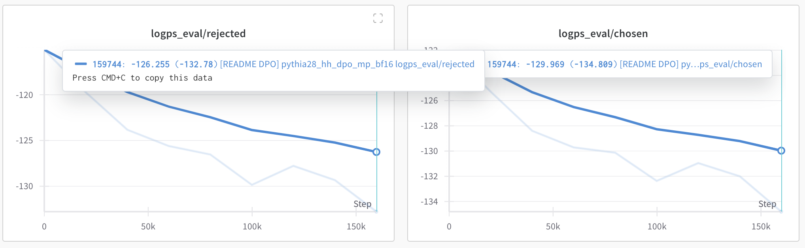

The behaviors of policies in the above diagram is counterintuitive: $**a^+$  has lower probability conditioned on $x$ than $a^-$ after the DPO training**. This weird phenomenon has been [observed since August of 2023](https://github.com/eric-mitchell/direct-preference-optimization/issues/36), but there is no reasonable explanation so far. In the meantime, whether online DPO has the same problem is unknown.

Our guess is that, it might be easier for the models to decrease both $\pi(a^+|x)$ and $\pi(a^-|x)$ as they have too low likelihood under $\pi(\cdot|x)$. Suppose this is true, online DPO should then increase $\pi(a^+|x)$ and decrease $\pi(a^-|x)$ as they are both from the mode of $\pi(\cdot|x)$. But, we didn’t run any experiment to verify it, so we’d like to leave this just as a hypothesis. Feel free to contact us if you want to dig into this problem! We’re very insterested in the answer for it!

**Verbosity Bias of DPO and Other Alignment Algorithms**

The DPO-aligned models tend to generate much longer responses than the SFT model, and the bias is further amplified during the iteration process **even though the reward model does not explicitly bias toward the longer responses.** As a case study, we use the reward model [weqweasdas/RM-Mistral-7B](https://huggingface.co/weqweasdas/RM-Mistral-7B) to label the responses and use the SFT checkpoint [HuggingFaceH4/mistral-7b-sft-beta](https://huggingface.co/HuggingFaceH4/mistral-7b-sft-beta). Then, we observe that the resulting model aligned by (iterative) DPO and [RAFT](https://arxiv.org/abs/2304.06767) is more than twice as long as the SFT model. On the other hand, we compute the pearson correlation coefficient for each prompt, group the prompts according to the average response length, and plot the heat map as follows.

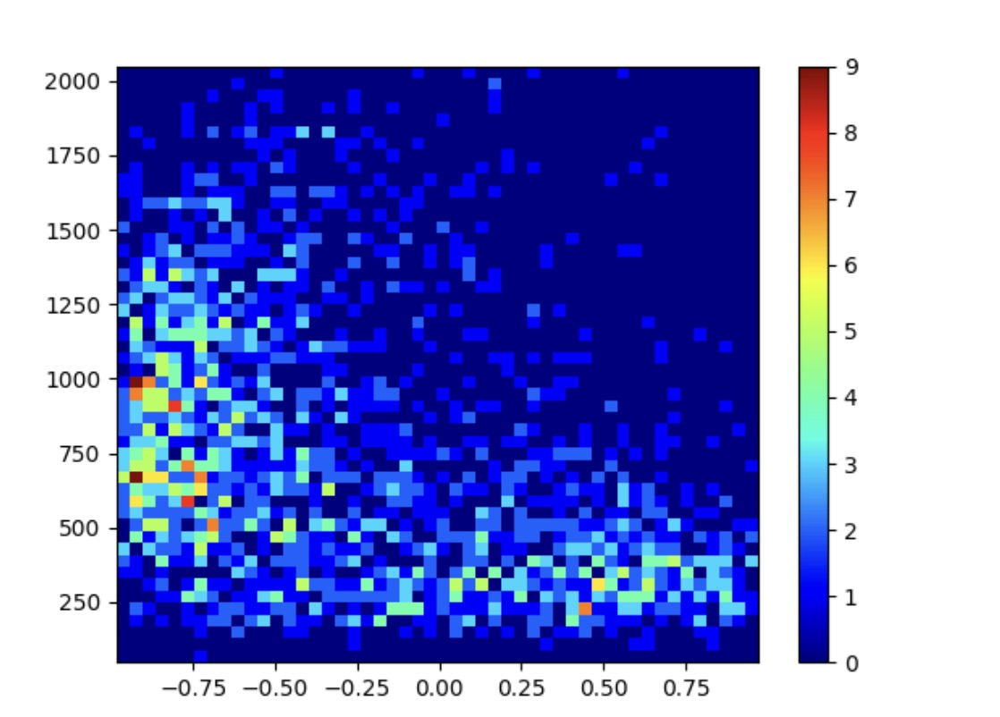

Heat map of the x: per-prompt pearson correlation coefficient between the response length and reward; y: the number of prompts. 

To some extent, the reward model may prefer the shorter responses or at least does not explicitly prefer the longer responses. However, the resulting models generate much longer responses compared to the SFT models. This is also related to the observations of likelihood decreasing in DPO training. We plot the density ratio $\pi_t(\cdot|x)/\pi_t(\cdot|x)$ on the training set as follows. 

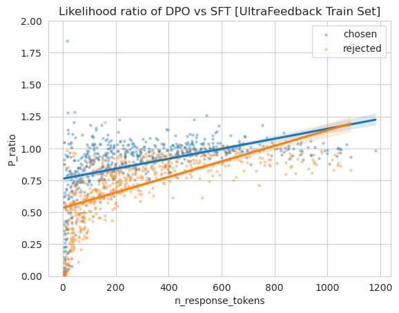

The density ratio (1000 pairs) between the DPO-aligned model (HuggingFaceH4/zephyr-7b-beta) and SFT model

As we can see, the average likelihood of both chosen response and rejected response decrease, but the short responses contribute most to this phenomena. On the other hand, the long responses are much stable in the likelihood. 

**Therefore, the verbosity issue may be related more to the algorithmic design.** Instead of trying to eliminating the length bias in the data or reward, we guess that we may need to explicitly handle this issue in the algorithmic design or modify the preference signal to encourage short responses given similar qualities. 

## 3.2 [Identity-preference Optimization (IPO)](https://arxiv.org/pdf/2310.12036.pdf)

A significant limitation of the DPO objective is that it still assumes the BT model to substitute the pairwise preferences by point-wise rewards. To address this limitation, [Azar et al. (2023)](https://arxiv.org/pdf/2310.12036.pdf) then introduced $\Phi$-preference optimization ($\Phi\text{PO}$).

**Connection between $\Phi$-mapping and the BT model**

[Azar et al. (2023)](https://arxiv.org/pdf/2310.12036.pdf) defines $\Phi$ as a general non-decreasing function that maps from $[0,1]$ to $\mathbb{R}$. Thus, the BT model is actually a special case of it, and can be defined as $\Phi(P) = \log\frac{P}{1-P}$. Check out [their paper](https://arxiv.org/pdf/2310.12036.pdf) if you’re interested about why this is the case.

**Problem of the BT model (particularly in DPO)**

Below, we plot the curve of the function $f(P)=\log\frac{P}{1-P}$. As can be seen, with the BT model, when $P(a^+ \succ a^- | x)=1$, we have $f(P) = r(x, a^+) - r(x, a^-) \rightarrow +\infty$, thus $\frac{\pi^*(a^-|x)}{\pi^*(a^+|x)}=0$ despite however strong regularization. As claimed by [Azar et al. (2023)](https://arxiv.org/pdf/2310.12036.pdf) , this issue is not too significant in RLHF, as the reward models usually underfit on the preference dataset, thus RLHF yields a final policy that is sufficiently regularized towards the reference policy. However, as DPO deosn’t train a reward model, the regularization from the underfitted reward model is then lost.

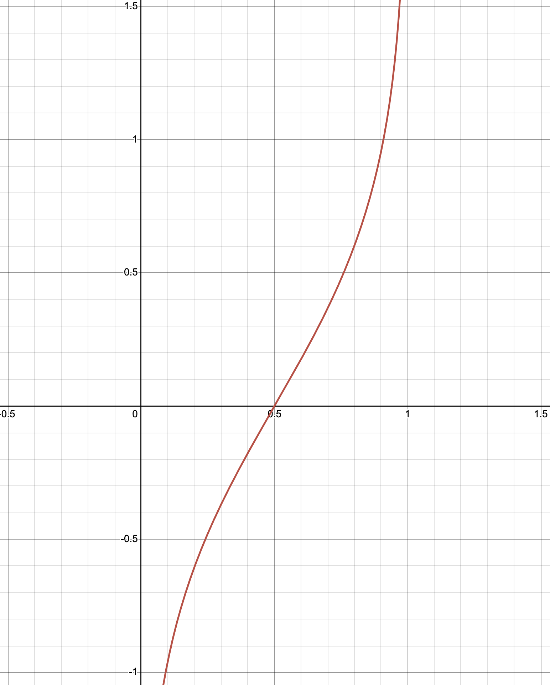

**IPO: Preference Optimization with Identity Mapping**

The solution from the IPO paper to the above problem is simple and straightforward: replacing the $\Phi(P) = \log\frac{P}{1-P}$ mapping function for the BT model by an identity mapping function $\Phi(P)=P$.

We hereby skip the long derivation of the empirical IPO loss function, and simply write it down following our notations:

$$
\ell^{\text{IPO}}(\theta)=\sum_{(x,a^+,a^-)}\left[\log\left[\frac{\pi_{\theta}(a^+|x)\pi_{0}(a^-|x)}{\pi_{\theta}(a^-|x)\pi_{0}(a^+|x)}\right] - \frac{1}{2\eta}\right]^2
$$

## 3.3 [Sequence Likelihood Calibration (SLiC)](https://arxiv.org/pdf/2305.10425.pdf)

Unlike the DPO and IPO objectives, the core idea of [SLiC](https://www.notion.so/Alignment-Guidebook-741e816522c64fa58832d76d4bd8e5e0?pvs=21) is to calibrate the likelihood of ranked sequences sampled from the policy being trained. On human preference data, one way to implement the SLiC loss function is given below:

$$
\ell^{\text{SLiC}}(\theta)=\sum_{x,a^+,a^-}\max\left[0, \delta-\log\pi_\theta(a^+|x)+\log\pi_\theta(a^-|x)\right] - \eta\cdot\log\pi_\theta(a_{\text{ref}}|x).
$$

Intuitively, the above SLiC loss function can be decomposed into two parts:

1. Rank function: this is to guarantee that the difference between $\log\pi_\theta(a^+|x)$ and $\log\pi_\theta(a^-|x)$ is greater than $\delta$ under the current policy $\pi_\theta$.
2. Cross-entropy regularizer: the second part of the SLiC loss is to encourage the model to stay close to the SFT model $\pi_0$ by decreasing the NLL of $a_{\text{ref}}$. This is no $\pi_0$ in this part, since $a_{\text{ref}}$ can be sampled from $\pi_0$.

Other possible choices of ranking function and regularizers have also been discussed by [Zhao et al. (2023)](https://arxiv.org/pdf/2305.10425.pdf) in their paper. Check out their paper, if you are interested in more details.

## 3.4 Comparison between DPO, IPO and SLiC

One natural question after reading through the above content about DPO, IPO and SLiC could be: which one among the three algorithms performs the best? Before we discuss their empirical performances, we can see that they [can be viewed as different choices of loss functions](https://arxiv.org/pdf/2402.05749.pdf): if we denote $\rho_\theta = \log \frac{\pi_\theta(a^+|x)}{\pi_0(a^+|x)} - \log \frac{\pi_\theta(a^-|x)}{\pi_0(a^-|x)}$, then

](loss-table.png)

Table from [Generalized Preference Optimization: A Unified Approach to Offline Alignment](https://arxiv.org/abs/2402.05749)

[Guo et al. (2024)](https://arxiv.org/pdf/2402.04792.pdf) compared different algorithms with their **online variants** with identical online AI labeller to annotate preferences, and the results ***evaluated by human raters*** are given below.

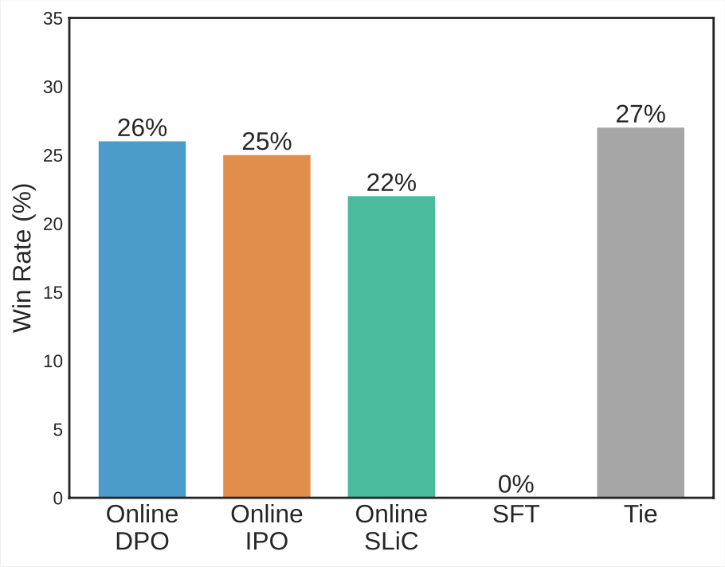

As can be seen, the outputs from onlind DPO/IPO/SLiC are preferred at 26%/25%/22% of the time against each other, whereas around 27% of the time they tie. The results basically confirmed that there is no significant difference between the performance of the online version of all these algorithms.

A similar experiment has been carried out by the Huggingface H4 team in an offline fashion, and [their results](https://huggingface.co/blog/pref-tuning) (given below) show that **offline** IPO outperformed offline DPO and offline [KTO](https://arxiv.org/pdf/2402.01306.pdf) (which hasn’t been introduced yet) for most of the beta (eta in this blog) values.

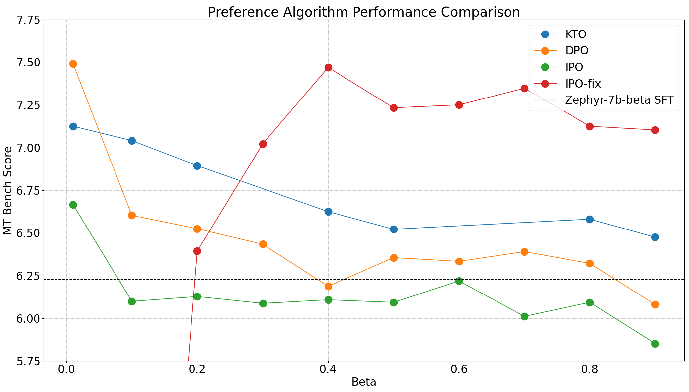

## 3.5 Rejection Sampling in RLHF

Rejection sampling is a widely utilized method in Monte Carlo tasks, which is designed to approximate a target distribution $q$ by sampling from a proposal distribution $p$. The efficiency of this process mainly depends on the density ratio

$$
\sup_x \frac{q(x)}{p(x)} \leq M.
$$

We first draw $n$ samples from the proposal distribution $p$, where each of the same is accepted with a probability $r = \frac{q(x)}{Mp(x)}$. Then, the accepted samples $\tilde{x}$ are representative of the target distribution $q$. For instance, the $q$ may be the $\pi_r$ for some learned reward and $p$ can be the $\pi_0$. In this case, 

$$
M = \sup_{x,a}\frac{\pi_0(a|x) \exp(r(x,a)/\eta)/Z(x)}{\pi_0(a|x)} = \sup_{x,a}\frac{1}{Z(x)} \exp(\frac{1}{\eta} r(x,a)).
$$

The primary challenge in rejection sampling is its low acceptance rate due to a large $M$. In practice, we usually use a fixed budget of $n$, and the number of accepted samples is set as a hyper-parameter, leading to the trade-off between approximation error and sample efficiency. There are three primary ways to use rejection sampling in RLHF.

- **[Inference-time Alignment](https://www.notion.so/Alignment-Guidebook-741e816522c64fa58832d76d4bd8e5e0?pvs=21):** in this case, for each query prompt $x$, we simply sample $n$ responses, and take the one with the highest reward as the final output (and reject all other samples). It is also referred to as the [best-of- $n$ policy](https://arxiv.org/pdf/2112.09332.pdf);
- **[Rejection-sampling Fine-tuning](https://arxiv.org/pdf/2304.06767v4.pdf):** we take one step further to fine-tune the LLM on the rejection-sampling samples, typically in an iterative manner.
- **RS as an exploration strategy:** more recently, rejection sampling is also used to collect samples for pairwise comparison. For instance, [Liu et. al. proposes](https://www.notion.so/Alignment-Guidebook-741e816522c64fa58832d76d4bd8e5e0?pvs=21) to use rejection sampling to generate samples for offline DPO training, while a line of works uses best-of-n policy and worst-of-n policy to construct the comparison responses in iterative DPO training.

It is widely validated that the simple rejection-sampling fine-tuning method often attains competitive or better performance than RL approaches for LLMs, including [training a helpful assistant](https://arxiv.org/pdf/2304.06767v4.pdf), [machine translation](https://arxiv.org/pdf/2308.08998.pdf), [mathematical reasoning](https://arxiv.org/pdf/2403.04642.pdf), [multi-turn natural language game](https://arxiv.org/pdf/2402.19446.pdf), [coding](https://arxiv.org/pdf/2307.14936.pdf). Therefore, the rejection sampling fine-tuning or simply best-of-n inference should serve as a stable baseline for the RLHF algorithmic design. 

On the other hand, it turns out that rejection sampling is also helpful as a heuristic exploration strategy to work in the online learning, as we have discussed previously. 

---

# 4 **Miscellaneous**

In this section, we’re going to introduce serveral topics spreading across RL-based and RL-free alignment algorithms. We didn’t find very organized way to cluster these topics, so we simply put them all together as miscellaneous issues about alignment.

## 4.1 Reward Modeling in RLHF

The reward model may be largely divided into five groups.

- **Bradley-Terry model:** the MLE of the BT model using pairwise comparisons, essentially a **classification** problem;
- **Direct preference optimization (DPO):** DPO trains the LLM as a reward, and we can use $\log \frac{\pi(a|x)}{\pi_0(a|x)}$ as the reward;
- **Preference model**: a preference model takes a prompt and two responses as the input, and output which one is better;
- **Regression-based model:** the regression-based model use the absolute value as the signal to directly conduct **regression** for training;
- **[LLM-as-a-Judge](https://arxiv.org/abs/2306.05685):** formulating the evaluation of responses as an instruction following task to the LLM.

We refer the interested readers to the following GitHub repo for a recipe to train the state-of-the-art reward model.

[https://github.com/WeiXiongUST/RLHF-Reward-Modeling](https://github.com/WeiXiongUST/RLHF-Reward-Modeling)

### LLM-as-a-Judge v.s. Reward Models:
from an out-of-distribution generalization perspective

As we mention before, RLHF suffers from **distribution shift** issues and the reward model often generalizes poorly to the out-of-distribution samples (**especially the samples with high rewards)**. Therefore, one important message is that ***the reward model is accurate only locally.*** In other words, accuracy is a rather limited metric. Another important metric to evaluate the qualify of a reward model is **the robustness in the face of distribution shift,** which is ****largely ignored previously. One thing we do know from [Figure](https://www.notion.so/Alignment-Guidebook-741e816522c64fa58832d76d4bd8e5e0?pvs=21) is that the larger model seems to be able to tolerate more distribution shifts.

<aside>
💡 As shown by Wang et al. (2024), a linear transformation of reward scores, e.g. $\tilde{r}(x,y)=r(x,y)+C(x)$ where $C(x):\mathcal{X}\mapsto\mathbb{R}$, doesn’t change the results of Bradley-Terry model.

</aside>

On the other hand, LLMs are known to have superior out-of-distribution generalization performance, thus they can alleviate the out-of-distribution issues of reward models. As discussed by Lee et al. (2023), **LLMs yield more effective reward scores** for RLHF, compared with reward models of the same size. In the meantime, instead of getting reward scores from LLMs, Guo et al. (2024) show that **LLMs also yield effective preferences for RL-free methods**. Moreover, they also show that **feedback from smaller LLMs can indeed improve the alignment of larger LLMs**, which paves a parrallel way to achieve weak-to-strong alignemnt other than the one from OpenAI.

In the recently released [RewardBench](https://github.com/allenai/reward-bench), the first author has also compared GPT-4 with RMs of varying size, and pointed out the superiority of GPT-4. The results from [the first author’s X post](https://x.com/natolambert/status/1772756296187744619?s=20) are given below.

| Model | Chat | Chat Hard | Safety | Reasoning |
| --- | --- | --- | --- | --- |
| GPT-4 Turbo | 95 | 74 | 87 | 87 |
| Best RM | 97 | 59 | 90 | 90 |

### Scaling Law of RM v.s. KL

Since the reward models generlize porrly on out-of-distribution samples, a natural question is about how well reward models can generalize to different policies where the difference can be measured by KL-divergence. This motivates the need of a new kind of scaling law for reward models, where the x-axis is the size of reward models, and the y-axis is the ***farthest accurate KL divergence*** of them. The farthest accurate KL divergence of a reward model $r$ is defined as the maxmal KL divergence between the policy being trained $\pi$ and the reference policy $\pi_{\text{ref}}$ such that the expected accuracy of preference by scores from $r$ is higher than a given thredshold. As the agreement degree between human labellers is usualy 70%, a reasonable thredshold could be 75%.

A sketch of the scaling law illustrated above is given below.

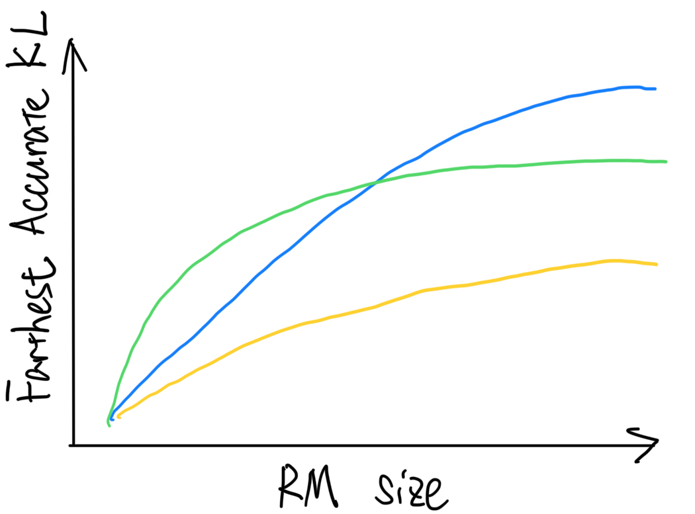

With a scaling law like this, we can easily tell **whether a new reward model needs to be trained** over the RL training of RLHF, as KL divergence from $\pi_t$ to the initial model can be easily tracked.

## 4.2 Evaluation in RLHF

Due to the distribution shift issue, the reward value is an unreliable metric to measure the performance of the aligned models. On the other hand, the human preference signals are expensive and slow to collect. In view of this, researchers have designed various benchmarks to fill this gap, where a popular way is to use the strong LLMs (like GPT4, Claude) to approximate human. Popular benchmarks focusing on helpfulness (instruction-following capabilities) include

- [**Chatbot Arena](https://lmsys.org/blog/2023-06-22-leaderboard/):**
    - Human asks any question to two anonymous models;
    - The models give responses;
    - Human identify the winner.
- [**MT bench**](https://lmsys.org/blog/2023-06-22-leaderboard/) is a set of $80$ multi-turn question in Writing, Roleplay, Extraction, Reasoning, Math, Coding, Knowledge I (STEM), and Knowledge II (humanities/social science), and each category consists of $10$ questions.
    - GPT4 is used to give an absolute score in [1, 10] to evaluate each response.

<aside>
❗ A practical problem of using GPT4 as the evaluator for MT Bench is that LLMs may raise inconsistent evaluations. We tried to switch GPT-4 to Claude-3, and found that the agreement between the two models is quite low.

</aside>

- [**Alpaca Eval**](https://tatsu-lab.github.io/alpaca_eval/): the model is deployed to compete with the GPT4-Turbo, where the GPT4-Turbo is also used to conduct pairwise comparison and reports win rate. The benchmark was initially designed for measure the instruction-following ability of the model.

<aside>
💡 Following the objective of aligning LLMs, we hereby emphasize that both MT bench and Alpaca Eval focus more on the instruction-following ability of LLMs rather than the aligned behaviours of LLMs. Considering the “alignment tax” investigated by Anthropic in their HH paper, alignment algorithms may not be able to improve the performance of <10B LLMs on following users’ instructions. Therefore, MT bench and Alpaca Eval might not be fully suitable for a comprehensive evaluation of alignment.
Moreover, alignment is orthogonal to the instruction-following ability: a powerful LLM might be very helpful but rude at the same time, while a weak LLM might behave friendly but is not so useful.

</aside>

The benchmark for other objectives include

- **[PKU-SafeRLHF](https://huggingface.co/datasets/PKU-Alignment/PKU-SafeRLHF-10K)** for safety;
- **[HELM Instruct](https://crfm.stanford.edu/2024/02/18/helm-instruct.html):** a multi-objective benchmark with absolute scores.

However, it is also known that the LLM suffers from the following limitations:

- The evaluation prompt set may not be representative enough to capture the real-world usage;
- Position/verbosity/.. bias: LLM may favor lengthier answers, regardless of their quality, favor the first answer in the pairwise comparison, and favor responses containing lists. There is also a work from [Li et al. (2023)](https://arxiv.org/abs/2310.01432) paving towards a solution to the lengthy bias. Check out Zongjie’s comment for more details!
- Self-enhancement bias: LLM may favor their own responses or responses from similar models;
- Limited reasoning ability: LLM may be inadequate in math and reasoning questions.

## 4.3 Theoretical Understanding of RLHF

The theoretical understanding of preference learning can date back to the [dueling bandit](https://www.cs.cornell.edu/people/tj/publications/yue_etal_09a.pdf), where the agent learns from relative preference feedback, instead of absolute reward value as the standard bandit or RL theory literature. Since then, extensive studies have been conducted to understand the learnability of the RLHF in either bandit or MDP scenario. However, all these works focus on the reward maximization only, and chase for the greedy and deterministic policy induced by the reward function, thus deviating from the practical applications. [**Inspired by the practice, the RLHF can be**](https://arxiv.org/pdf/2312.11456.pdf) formulated as a **reverse-KL regularized contextual bandit**, consistent with the practical applications, in **offline, online, and hybrid setting.** Before continuing to introduce the theoretical framework and results, we first assume the following computational oracle, which can be reasonably approximated by many practical algorithms like PPO, DPO, SLIC, and IPO mentioned before.

**Computational Oracle**: for any given reward $r$, we assume that we can approximate $\pi_{r, \eta} := \mathcal{O}(r, \pi_0, \eta).$

**Linear Reward Space**: we assume that $r^*(x,a) = \phi(x,a)^\top \theta^*$, where $\phi: (x,a) \to R^d$ is a feature map.  ****

**Offline learning with conservative reward is efficient:** 

The first setting is the offline setting, where we can only learn from an offline dataset $\mathcal{D} = \{(x_i, a_i^1, a_i^2, y_i)\}_{i=1}^n$ without further querying $\mathcal{P}$. If we take the following policy:

$$
\hat{\pi} = \mathcal{O}\big(\underbrace{r_{\mathrm{MLE}} -c \cdot \sqrt{d}\|\phi(x,a) - \mathbb{E}_{x \sim d_0, a \sim \pi_0} \phi(x,a)\|_{\Sigma^{-1}_n}}_{\text{Lower confidence bound of } r^*}, \pi_0, \eta \big)
$$

where the high-level idea is to use a **conservative reward model** because the reward estimator is always a lower confidence bound of the $r^*$**.** Here $\Sigma^{-1}_n$ denotes the covariance matrix estimated on the offline dataset:

$$
\Sigma^{-1}_n = \lambda I + \sum_{(x,a^1,a^2) \in \mathcal{D}} \big(\phi(x,a^1)-\phi(x,a^2)\big)\big(\phi(x,a^1)-\phi(x,a^2)\big)^\top
$$

Here the $\mathbb{E}_{x \sim d_0, a \sim \pi_0} \phi(x,a)$ serves as the reference vector because due to the preference learning nature, we can only evaluate the uncertainty for a pair of samples. In practice, we should use a estimated version from the samples to replace the expected one.

The ideal case will be the feature difference $\big(\phi(x,a^1)-\phi(x,a^2)\big)$ can span the whole space, calling for a diverce output distribution. Then, we have the following result.

**[Theorem 1](https://arxiv.org/pdf/2312.11456.pdf)** With high probability, for any policy $\pi$, we have

$$
\eta \cdot \mathbb{E}_{x \sim d_0} \big[\mathrm{KL}(\pi(\cdot|x)\|\hat{\pi}(\cdot|x))\big] + J(\pi) - J(\hat{\pi}) \lesssim \sqrt{d} \mathbb{E}_{x \sim d_0, a \sim \pi} \|\phi(x,a) - \mathbb{E}_{x \sim d_0, a \sim \pi_0} \phi(x,a)\|_{\Sigma^{-1}_n}.
$$

When the offline dataset (summarized by $\Sigma^{-1}_n$) offers a good coverage for $(\pi - \pi_0)$, both the KL divergence and the value converge. This is summarized by the following coverage assumption on the preference dataset:

$$
\mathbb{E}_{x \sim d_0, a \sim \pi} \|\phi(x,a) - \mathbb{E}_{a \sim \pi_0} \phi(x,a)\|_{\Sigma^{-1}_n} \leq \frac{1}{\sqrt{n}} C_{\mathrm{cov}}(\pi),
$$

where the $C_{\mathrm{cov}}(\pi)$ measures how well the preference dataset cover the target $(\pi - \pi_0)$, and in the finite sample case, this can be related to the density ratio between the distirbutions. 

Note that  $\pi$ can be arbitrary, meaning that we may not converge to the optimal policy, but as long as our dataset can cover some good policy, we can compete with it. Unfortunately, due to the large distribution shift in practice, we may not expect that the offline dataset can provide a good coverage (see Section 2.1 for the discussion).  This motivates us to consider the following online iterative learning.

**Preference learning benefits from online exploration:** 

the second setting is the online iterative setting, where we can query the human preference oracle during the training. We focus on the iterative setting where we update the policies every $m$ steps (the batch size) for a sparse update. If we take the exploration policies as 

$$
(\tilde{\pi}_t^1, \tilde{\pi}_t^2)  = (\pi_t, \pi_0)
$$

then the iterative DPO introduced in [Section](https://www.notion.so/Alignment-Guidebook-741e816522c64fa58832d76d4bd8e5e0?pvs=21) 3 has the following theoretical guarantee.

**[Theorem 2](https://arxiv.org/pdf/2312.11456.pdf)**  With a batch size $m$, after at most $T = \tilde{O}(d)$ iterations, with high probability, we can find a good policy such that 

$$
\eta \cdot \mathbb{E}_{x \sim d_0} \big[\mathrm{KL}(\pi^*(\cdot|x)\|\hat{\pi}(\cdot|x))\big] + J(\pi^*) - J(\hat{\pi})  \lesssim \sqrt{\frac{d}{\gamma^2m}} + \beta \|\mathbb{E}_{x \sim d_0} [\phi(x,\pi^*) - \phi(x, \pi_0) \|_{\Sigma^{-1}_{\textcolor{red}{\mathrm{off+online}}}}.
$$

**Faster convergence rate:** the difference between Theorem 1 and Theorem 2 is that part of the data is now collected from online exploration. In this case, we expect the coverage coefficient can be largely improved for most of the average instances. This is because, in  the coverage target is the feature difference

$$
\phi(x, \pi^*) - \phi(x, \pi_0)
$$

and the online data is collect by  $(\pi_t, \pi_0)$ , under the assumption that the offline dataset is diverse enough so that   $\pi_t\to \pi^*$, the distribution shift between the online data and the coverage target gradually becomes smaller and should be able to provide a much better coverage coefficient $C_{\mathrm{cov}}$ .

Meanwhile, by choosing an optimal m the total number of preference oracle query $mT=\tilde{O}(\frac{d^2}{\epsilon^2})$ matches that of sequential online setting $m=1$, meaning that online iterative learning with large batch size will not hurt sample efficiency compared to the sequential online setting.

**The design of online exploration strategies**

One critical component in online learning is to design efficient exploration policies to effectively explore the prompt-response (state-action) space. If the offline dataset cannot provide enough coverage or we study learning from scratch, then, we must adopt some exploration strategies. In this case, we may still take  $\pi_t^1 = \pi_t$ , but modify 

$$
\pi_t^2(\cdot|x) = \arg\max\|{\phi(x, \pi_t) - \phi(x,\pi_t^2)}\|_{\Sigma_{t,m}^{-1}}
$$

Let’s intuitively illustrate the insights behind:

- The first agent ***exploits*** the collected samples, and choose the best-guess so far;
- The second agent tends to maximize **the uncertainty** of their feature difference and improve the diversity of the data collected in the online process to facilitate ***exploration***.

While the uncertainty quantification in general neural network remains open, our results should justify and motivate the practical algorithms at least in principle. For instance, many practical applications (Claude, and LLaMA2) found that it is crucial to use different variants of current model to collect new samples instead of one model so that we can increase the feature difference of the two policies thus maximizing the uncertainty. Some common choices to heuristically achieve the goal include

- Use the variants of  $\pi_t^1 = \pi_t$ by taking the models from different training steps;
- Use different sampling temperature.
- We can use the rejection sampling to approximate such an exploration principle, which achieves tremendous success in [snorkelai/Snorkel-Mistral-PairRM-DPO](https://huggingface.co/snorkelai/Snorkel-Mistral-PairRM-DPO) , and ranks 2nd in the [Alpaca Eval leaderboard.](https://tatsu-lab.github.io/alpaca_eval/)

<aside>
💡 **Take-away messages:**

Online/hybrid RLHF/DPO is statistically efficient as long as there are some low-rank structures in the reward space.

Preference learning benefits from online explorations; with a suitable batch size, the iterative framework does not hurt the performance; 

The online/hybrid framework can be implemented by replacing the information-theoretical computation oracle $\mathcal{O}$ with any reasonable practical offline algorithm: RLHF, DPO, SLIC, IPO…

</aside>

## 4.4 Alignment without External Preference Signals

All we dicussed so far assume either a preference oracle or a given reward function. A natural extension is to remove this dependency on the external signals.

The most straightforward way to achieve this objective is getting preference annotation from the LLM policy being trained, which has been explored by Yuan et al. (2024), and named as “**self-rewarding**”. Briefly, the core idea is similar to online DPO with LLM-as-a-judge, but gets preferences over responses not from an external LLM but instead the policy being trained. The algorithm is summarized below:

$$
\begin{aligned}
\text{for}~&\textcolor{red}{x}~\text{in}~~\mathcal{D}: \\
&\text{sample two responses}~a^1, a^2\sim \pi_{\theta^t}(\cdot|x) \\
&\text{annotate them by}~\textcolor{red}{\pi_{\theta^t}}~\text{to get}~a^+, a^- \\
&\text{update}~\theta^{t}~\text{by~loss}~\ell^{\text{DPO}}(\theta^t) \triangleq\log \sigma\left[\eta \log \frac{\pi_{\theta^t}({a}^+|x)}{\pi_0({a}^+|x)} - \eta \log \frac{\pi_{\theta^t}({a}^-|x)}{\pi_0({a}^-|x)}\right] \\
&~t=t+1
\end{aligned}
$$

The gist of self-rewarding is that the off-the-shelf LLM to be aligned can provide effective feedback to the alignment of itself, suppose that distinguish a response of higher quality is an easier task compared with generating a reqsponse of high quality. Although this assumption is debatable as we discussed in Section 4.1, self-rewarding makes the alignment **scalable** since the best-performing base model can always be utilized to provide feedback for itself. In contrast to the weak-to-strong from OpenAI, self-rewarding is like strongest-to-strongest.

Another example is the GAN-like algorithm **Self-Play fIne-tuNing ([SPIN](https://arxiv.org/pdf/2401.01335v2.pdf))**, which takes an offline SFT dataset $\mathcal{D}$ as the input and the goal is to fully use the SFT data so that the generation distribution of the LLM is indistinguished from the data distribution.  The core of SPIN is the self-play mechanism, where both the main player and the opponent are the same LLM, but from different iteration. Specifically, SPIN maintains 1) main player, which is the LLM at current iteration, serving as the discriminator to distinguish opponent's responses from ground truth responses (SFT data); 2) opponent player, which is the LLM from previous iteration, with the goal of generating responses to be indistinguishable to the SFT data. SPIN proceeds iteratively and consists of two steps at each iteration: (1) training the main player and (2) update the opponent player. If training succeeds, the ultimate generation distribution is indistinguishable from the SFT data thus fully utilizing the SFT data. 

---

# 5 Beyond the Bradley-Terry Model

Following the IPO work introduced above, a major concern about the classic RLHF framework is whether the BT model can capture the complicated human preference. 

- **Total order over response space:** Assuming a $r^*$ implies a total order over the response space:
    - This is inconsistent with the ``contrast effect'' and is unlikely to hold when we aggregate the preference over a diverse set of labelers.

$$
\mathcal{P}(a^1 > a^2 |x) > 0.5 \& \mathcal{P}(a^2 > a^3 |x) > 0.5 \rightarrow \mathcal{P}(a^1 > a^3 |x) > 0.5
$$

- **Collapse in generation diversity:** reward-maximizer tends to lose the decreases the entropy;
- **Overlook the minority preference:** the BT-framework does not take personalization and preference conflict into consideration and is likely to align toward the majority group and overlook the preference of the minority group.

## 5.1 Nash Learning: Dropping the Reward Model

One direct modification is to drop the reward structure, and treat the RLHF as a *two-player Game* between two LLMs $\pi^1$ and $\pi^2$. This is referred to as the **[Nash Learning (NLHF).](https://arxiv.org/pdf/2312.00886.pdf)** To illustrate the idea of Nash learning, we define the relative preference as 

$$
R^*(x,a^1,a^2) = \log \frac{\mathcal{P}(a^1 \succ a^2|x,a^1,a^2)}{\mathcal{P}(a^1 \prec a^2|x,a^1,a^2)},
$$

Then, the value of the game is defined as 

$$
        J(\pi^1,\pi^2)  = \mathbb{E}_{x\sim d_0}\mathbb{E}_{a^1\sim\pi^1,a^2\sim\pi^2}\Big[R^*(x,a^1,a^2) - \eta \mathrm{KL}(\pi^1(\cdot|x)\|\pi_0(\cdot|x)) + \eta \mathrm{KL}(\pi^2(\cdot|x)\|\pi_0(\cdot|x))  \Big].
$$

If we only consider the policy with the same support as $\pi_0$, there exists a *unique and symmetric* Nash equilibrium of the following minimax problem:

$$
(\pi_*^1, \pi_*^2) = (\pi_*, \pi_*) = \argmax_{\pi^1 \in \Pi}\argmin_{\pi^2 \in \Pi} J(\pi^1,\pi^2),
$$

where $J(\pi_*, \pi_*) = 0$ by the anti-symmetric structure. Suppose that we can find an $\epsilon$-approximate Nash policy $\hat{\pi}^1$ for the first player in the sense that 

$$
J(\pi_1^*, \pi_2^*) - \underbrace{\min_{\pi^2} J(\hat{\pi}^1, \pi^2)}_{\text{The strongest opponent}} = 0 - \min_{\pi^2}J(\hat{\pi}^1, \pi^2) \leq \epsilon
$$

- **Consistently outperform All the opponents:**

$$
\min_{\pi^2 \in \Pi} \mathbb{E}_{x\sim d_0}\mathbb{E}_{a^1\sim\hat{\pi}^1,a^2\sim\pi^2}\Big[R^*(x,a^1,a^2) - \eta \mathrm{KL}(\hat{\pi}^1(\cdot|x)\|\pi_0(\cdot|x)) + \eta \mathrm{KL}(\pi^2(\cdot|x)\|\pi_0(\cdot|x))  \Big] \geq - \epsilon.
$$

- **Consistently being preferred with small KL coefficient**
    
    $$
    \min_{\pi^2 \in \Pi} \mathbb{E}_{x\sim d_0}\mathbb{E}_{a^1\sim\hat{\pi}^1,a^2\sim\pi^2} \mathcal{P}(x, a^1, a^2) > \frac{1}{1 + \exp(\epsilon)} \approx 0.5.
    $$
    
- **Automatically adapt to the reward framework:** when the BT model holds, the Nash policy also maximizes the KL-regularized reward up to $\epsilon$.

NLHF is a game-theoretic learning paradigm and does not attain a closed-form solution as the single-agent case. However, combing the fact that the unique Nash equilibrium is symmetric, we can show that 

$$
\pi^*(a|x) \propto \pi_0(a|x) \exp\big(-\frac{1}{\eta} \mathbb{E}_{a' \sim \pi^*(a'|x)} R(x,a,a')\big),
$$

where the $\pi^*$ appears on both sides. We mention in passing that the offline IPO can be viewed as a special case of the game by fixing the second opponent as the data distribution. 

An initial planning algorithm is presented in the original [Nash Learning paper](https://arxiv.org/pdf/2312.00886.pdf). The NLHF is still an under-explored and promising learning paradigm, with many interesting problems to be solved.

## 5.2 Multi-objective Learning and Human-preference-aware Alignment

Another fundamental issue of the single-reward model cannot capture the conflict preference among humans. This is because humans typically have a set of intricate or even *contradictory* targets in real-world applications. In view of this, it is natural to adopt a **multi-objective formulation** to replace the scalar reward with a reward vector $r\in \mathbb{R}^k$. 

For instance, in LLaMA2 project, the helpfulness reward and safety reward are trained separately, leading to $k=2$. Meanwhile, in the [nvidia/HelpSteer dataset](https://huggingface.co/datasets/nvidia/HelpSteer), each sample is evaluated in helpfulness, correctness, coherence, complexity, and verbosity by the humans in a scale of 0-5. We plot the Spearman correlation coefficients of these different objectives as follows, where we can see that some of the objectives (helpfulness and correctness) are positively related, while some of them (e.g., verbosity, complexity and coherence) are negatively related.

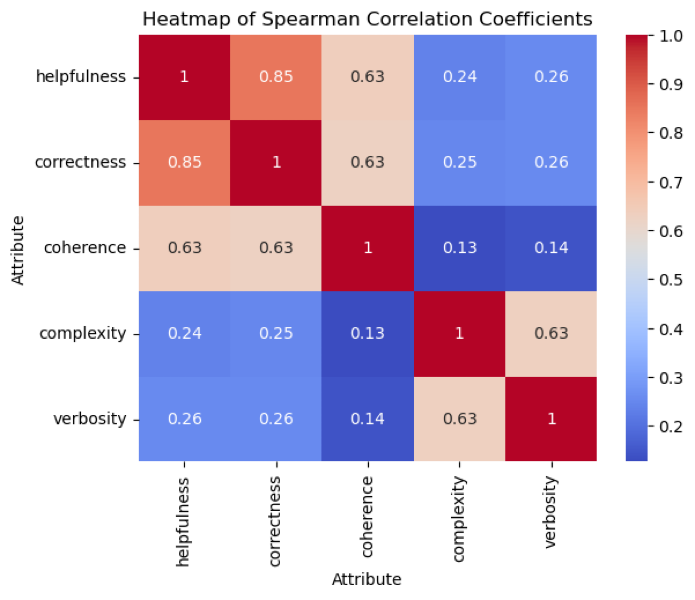

Moreover, even the LLMs have their own preference in terms of different objectives, as demonstrated by [this study](https://crfm.stanford.edu/2024/02/18/helm-instruct.html):

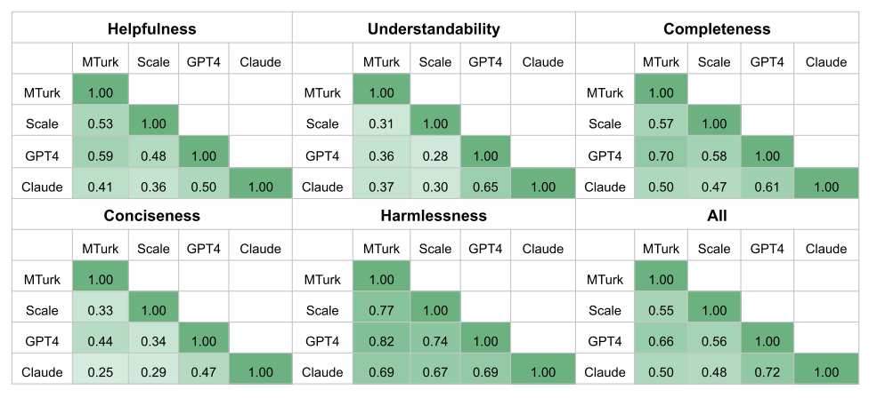

To handle the multi-objective RLHF, a popular approach is based on parameter interpolation, meaning that for each objective $i$, we can train a model $\theta_i$. Then, given a new user with preference $\nu_1, \cdots, \nu_k$, the final model is given by

$$
\theta = \theta_1 \nu_1 + \cdots + \theta_k \nu_k.
$$

The coefficient combination in the *parameter space* leads to a preference objective combination, and performs well in practice. However, one needs to store all the base models $\theta_1, \cdots, \theta_k$, and cannot use a single model to serve a diverse group of users, thus is **inference-unfriendly.**

In recognition of the above concerns, another idea is to embed the human-preference into the input, leading to the [multi-objective preference-aware alignment.](https://arxiv.org/pdf/2402.18571v1.pdf) Specifically, we model the human preference as a *direction*, i.e., a unit vector $\nu \in \mathbb{R}^k$ and the preference-conditioned reward is 

$$
R(x,\nu,a) = \nu^\top r(x,a)
$$

The learning objective is accordingly modified as 

$$
\max_{\pi} \mathbb{E}_{\nu \sim d_\nu} J(\nu, \pi) = \max_{\pi} \mathbb{E}_{\nu \sim d_\nu} \mathbb{E}_{x\sim d_0, a\sim \textcolor{red}{\pi(\cdot|x,\nu)} }[R(x,\nu, a)].
$$

There is also [work](https://arxiv.org/pdf/2402.08925v1.pdf) considering the robust preference learning in the face of multiple user groups, by optimizing the worst-user-group preference. 

**Three take-away messages are** 

- **Single-reward is short in expressivity:** while a multi-objective formulation can provide more fine-grained characterization for the complicated human preference (scalar v.s. vector);
- **Humans and LLMs possess different preferences:** it is reported that human-human agreement and human-GPT-3.5-Turbo agreement are about 60% - 65%;
- **Human-preference-aware alignment:** the user information can be embedded into the input space to mitigate the preference conflict.

## 5.3 Pointwise Feedback - Kahneman-Tversky Optimization

Another direction to go beyond the commonly used Bradley-Terry model is to replace pairwise feedback with pointwise feedback. In the later case, the system only needs to collect **whether a response $a$ is desired** to the prompt $x$. So, instead of collecting triplets $(x,a^+,a^-)$, we only need $(x,a, +/-)$. 

Such signals cost much less to collect than preferences over pairs of responses:

1. Just need to do the forward pass of an LLM once to generate a single response. A pair of responses, on the other hand, require twice the forward passes. So, we save half of the price on serving the models.
2. Implicit feedback ($+/-$) are far more than the explicit feedback. For example, in a music AI, we can safely assume negative feedback if a user skips the generated song after listening to the first 10 seconds.

To implement the above idea, [Ethayarajh et al. (2024)](https://arxiv.org/abs/2402.01306) proposed the Kahneman-Tversky Optimization (KTO) algorithm which is intruded briefly as follows.

## Prospect Theory by Kahneman & Tversky

Unlike the core objective of RLHF, Kahneman & Tversky’s **prospect theory** argues that **people do not aim to maximize expected reward** when facing an **uncertain** event. Instead, because people are loss-averse, they are actually more sensitive to losses than gains in the same degree.

The utility function of an outcome following prospect theory can then be formulated as 

$$
u(Z)\triangleq\sum_{z\in Z}w_z \cdot v(z-z_{\text{ref}}) 
$$

where $Z=\{z\}$ is a random variable representing outcomes, $w$ is a weighting function capturing how much humans overestimate the probability of rare events, and $v:z\mapsto \mathbb{R}$ is a value function estimating the sensitivity of losses/gains of an outcome $z$ relative to a reference point $z_{\text{ref}}$.

Below, the authors of KTO paper plot the implied utility functions by various methods we’ve discussed above.

](implied_human_utility.png)

From [https://arxiv.org/abs/2402.01306](https://arxiv.org/abs/2402.01306)

## KTO’s  Objective Function in Practice

Below, we sketch the **offline** KTO objective function following [Ethayarajh et al. (2024)](https://arxiv.org/abs/2402.01306) in practice.

$$
\ell^{\text{KTO}}(\theta) = \sum_{x,a} \left[ w(a)\left(1-v(x,a;\beta)\right) \right]
$$

These functions are implemented as follows:

- $w(a)= \begin{cases}
\lambda_D &\text{if}~a\sim a_+ | x\\
\lambda_U &\text{if}~a\sim a_- | x

\end{cases}$ where $\lambda_D$ and $\lambda_U$ are hyperparameters
- $v(x,a;\beta) = \begin{cases}
\sigma\left(r(x,a) - a_{\text{ref}}\right) &\text{if}~a\sim a_+ | x\\
\sigma\left(- r(x,a) + a_{\text{ref}}\right) &\text{if}~a\sim a_- | x

\end{cases}$ where
    - $r(x,a)=\beta \log\frac{\pi_\theta(a|x)}{\pi_\text{ref}(a|x)}$ takes the optimal reward function derivated by the DPO work.
    - $a_\text{ref} = \mathbb{E}_{x'} \left[\beta D_{KL}\left[\pi_\theta(y'|x')||\pi_{\text{ref}}(y'|x') \right]\right]$ is the expected expected KL divergence between the currenct policy $\pi_\theta$ and the reference policy $\pi_{\text{ref}}$.

The specification of these functions rely quite much on heuristics. We hereby only list the authors’ choices in the following section.

### Implemention Choices

- $\beta$ value: the authors found that $\beta = 0.1$ is close to best on vairous tasks. On the other hand, the Huggingface’s H4 team found that $\beta = 0.0$ leads to even better performance in their experiments. We hereby want to emphasise that both teams evaluated KTO by the performance of models on tasks, which is not the objective of aligning models. It’s hardly to tell whether this is a generally good choice with the evidence so far.
- $\lambda_D$ and $\lambda_U$: the values of these two hyper-parameters are **roughly** **inversely proportional to** the ratio of desired responses $a_+$ and undesired responses $a_-$, i.e. $\frac{\lambda_D n_D}{\lambda_U n_U} \in [1, \frac{4}{3}]$.
- $\hat{a}_{\text{ref}}$: this might be the most tricky issue in our opinion. In KTO paper, the authors use a batch of size $m$ to estimate this term by $\max\left( 0, \frac{1}{m}\sum\log\frac{\pi_\theta(y_U'|x')}{\pi_{\text{ref}}(y_U'|x')} \right)$ which is a **Monte-Carlo estimation with only undiresed responses**. Notice that this step costs quite many flops!

Notice that, the KTO’s performance so far is evaluated more on tasks like MMLU or GSM8K, which we argue is not the most appropriate way. However, one super interesting results is about the **data efficiency of KTO with only one response per prompt**. As shown in the Table by [Ethayarajh et al. (2024)](https://arxiv.org/abs/2402.01306) below, compared with DPO trained with two responses per prompt, KTO with one can significantly outperform it. This finding further signifies the pratical value of KTO, as pointwise feedback are more abundant and easier to collect in practice!

](KTO-table-1.png)

From [KTO: Model Alignment as Prospect Theoretic Optimization](https://arxiv.org/pdf/2402.01306.pdf)

---

# 6 Other Research Directions; End note

In this blog post, we presented a brief overview of the preference learning in the context of language model. There are many other active research topics or interesting research problems we have not covered:

- **Superalignment - weak2strong**
    - When LLMs become more intelligent, we might not be able to align/supervised them in the future (may not be very near). In this case, we still want to ensure that those superhuman models are aligned. One promising way is to use weaker models to align stronger ones, which can be implemented in the following two fashions.
    - Supervised learning: As propsed and shown by OpenAI, weaker supervisor models can elicit capabilities of stronger models, thus makes it possible to align stronger models with weaker ones.
    - Discriminating generations: In contrast, OAIF by Guo et al. (2024) shows that weak LLMs can raise useful and effective preference over responses to generation from stronger models, which weaker AI takes an easier discriminative task.
    - Open question: any other ways for us to align superhuman models? Especially the methods that don’t rely on AI.
- **Preference optimization for other generative models**
    - diffusion model;
    - multi-modal LLM;
- **Preference Signal Construction**
    - Human feedback alone will not be sufficient to exercise scalable oversight for superhuman AI systems
        - [human miss over half of the critical error in evaluating summarized passages;](https://arxiv.org/pdf/2206.05802.pdf)
        - [weak-to-strong generalization for superalignment](https://openai.com/research/weak-to-strong-generalization);
        - it is not feasible to expect the humans to put extensive research and efforts in practice;
    - Implicit feedback signal: we hereby use music AI such as Suno as an example. Suppose an user plays a generated song for only 5 seconds, we can safely assume that the user dislike it. Therefore, it’s possible to extract such implicit feedback from user in practice.
- **Alignment for reasoning**
    - [Mathematical reasoning](https://arxiv.org/pdf/2305.20050.pdf)
    - [Coding](https://arxiv.org/pdf/2403.04642.pdf)
    - Agent
- **Alignment Tax**
    - [The models may suffer from performance degradation on particular tasks after alignment.](https://arxiv.org/pdf/2203.02155.pdf)
    - E.g., the calibration is reduced [(Figure 8 of GPT4-report);](https://arxiv.org/pdf/2303.08774.pdf)
    - Some initial study

---

Alignment for foundation generative model is still an active research direction and is still developing rapidly toward the goal of AGI.