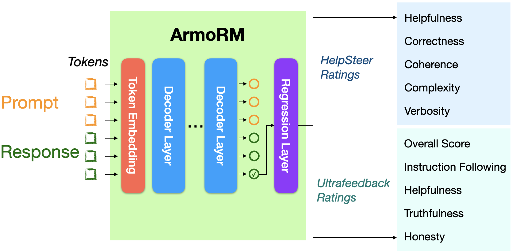

This work is authored by [Haoxiang Wang*](https://haoxiang-wang.github.io/), [Wei Xiong*](https://weixiongust.github.io/WeiXiongUST/index.html), [Tengyang Xie](https://tengyangxie.github.io/), [Han Zhao](https://hanzhaoml.github.io/), [Tong Zhang](https://tongzhang-ml.org/) (* indicates equal contribution)


- **Code:** [https://github.com/RLHFlow/RLHF-Reward-Modeling](https://github.com/RLHFlow/RLHF-Reward-Modeling)
- **Model:** [https://huggingface.co/RLHFlow/ArmoRM-Llama3-8B-v0.1](https://huggingface.co/RLHFlow/ArmoRM-Llama3-8B-v0.1)
- **Technical Report:** To be released in June, 2024
- **Contact:** Haoxiang Wang ([hwang264@illinois.edu](mailto:wx13@illinois.edu))
---
# Abstract

Reinforcement learning from human feedback (RLHF) has emerged as the primary method for aligning large language models (LLMs) with human preferences. The RLHF process typically starts by training a reward model (RM) using human preference data. Conventional RMs are trained on pairwise responses to the same user request, with ***relative*** ratings indicating which response humans prefer. The trained RM serves as a proxy for human preferences. However, due to the black-box nature of RMs, their outputs lack interpretability, as humans cannot intuitively understand why an RM thinks a response is good or not. As RMs act as human preference proxies, we believe they should be human-interpretable to ensure that their internal decision processes are consistent with human preferences and to prevent [reward hacking](https://arxiv.org/abs/2209.13085) in LLM alignment. To build RMs with interpretable preferences, we propose a two-stage approach: i) train an **Absolute-Rating Multi-Objective Reward Model** (ArmoRM) with multi-dimensional absolute-rating data, each dimension corresponding to a human-interpretable objective (e.g., honesty, verbosity, safety); ii) employ a **Mixture-of-Experts** (MoE) strategy with a gating network that automatically selects the most suitable reward objectives based on the context. We efficiently trained an ArmoRM with [Llama3-8B](https://ai.meta.com/blog/meta-llama-3/) and a gating network consisting of a shallow MLP on top of the ArmoRM. Our final reward model, [ArmoRM-Llama3-8B-v0.1](https://www.notion.so/Interpretable-Preferences-via-Multi-Objective-Reward-Modeling-and-Mixture-of-Experts-995c5f5bdd474cbb86a22d7395ca4927?pvs=21), **ranks first on the leaderboard of [RewardBench](https://huggingface.co/spaces/allenai/reward-bench)**, a benchmark evaluating RMs for language modeling. The performance of our model surpasses the LLM-as-a-judge approach using GPT-4 and the common Bradley-Terry modeling approach with Llama3-8B or Yi-34B by a margin.

# Preliminaries

## **RLHF Pipeline**

The standard RLHF-based alignment pipeline, as established by the foundational [InstructGPT](https://arxiv.org/abs/2203.02155) work (the algorithmic framework behind ChatGPT), involves three main stages:


1. **Supervised Fine-Tuning (SFT)**: This initial stage involves training the language model on a dataset of human-written responses to align the model’s outputs with human expectations. This stage sets a baseline for the model's understanding of tasks and appropriate responses.
2. **Reward Modeling**: In this stage, the model is trained to predict the rewards (usually human preferences or ratings) associated with different outputs. This reward model is critical for evaluating the quality of model-generated responses and serves as a foundation for subsequent policy optimization. For more details about the reward modeling, you can read our [previous blog post](https://rlhflow.github.io/posts/2024-03-23-bradley-terry-reward-model/) to understand the common approach of Bradley-Terry reward modeling.
3. **Policy Optimization**: During this final stage, the model is fine-tuned to maximize the expected rewards as estimated by the reward model, thereby aligning the model’s outputs even more closely with human preferences.

The term RLHF usually refers to the latter two stages, excluding the SFT stage. RLHF can be understood as an approach for **preference tuning,** which encourages the model to output human-preferred responses for a wide range of prompts.  While there is a line of works bypassing the reward modeling stage by proposing offline direct preference learning algorithms like Slic, DPO, and IPO, [recent works show](https://arxiv.org/pdf/2405.07863) that leveraging an external reward model to iteratively label on-policy data is also helpful to improve model performance. 

## The Need for Interpretable Reward Models

Reward models (RMs) play a crucial role in the alignment of LLMs using RLHF. They provide a scalable and efficient way to capture human preferences and guide the optimization of LLM policies. However, common RMs, such as the most popular [Bradley-Terry RMs](https://rlhflow.github.io/posts/2024-03-23-bradley-terry-reward-model/), are typically black-box models that output scores or preferences without providing human-interpretable explanations. 


Furthermore, when applying RLHF for LLM alignment, the phenomenon of reward hacking is widely observed, where the aligned LLMs generate high-reward responses (rated by the RM) that do not align with actual human preferences. A notable example of this is the [verbosity bias](https://arxiv.org/abs/2310.10076), where aligned LLMs produce longer-than-necessary responses because the RM favors length, regardless of quality. The following figure from [Singhal et al., 2023](https://arxiv.org/abs/2310.03716) illustrates how a preference for longer responses by the RM leads to more verbose outputs from the corresponding LLM.


How can we mitigate the reward hacking issue? We believe one solution is to make the reward model more **interpretable** and [**debuggable**](https://gradientscience.org/glm_saga/). Let's continue considering the verbosity bias example. Suppose the RM's output is interpretable, explaining that it assigns a high score to a response due to two factors: 40% for its helpfulness and 60% for its length. In this case, we can see that the RM has a verbosity bias. Furthermore, if the RM is debuggable, we could adjust its decision-making process to base its scoring 100% on helpfulness, regardless of response length, thus mitigating the verbosity bias.

Enhancing the interpretability of RMs also allows humans to verify whether RMs have similar internal decision processes to humans when acting as proxies for human preferences. We believe that this thorough human verification process could ensure that RMs are deeply and comprehensively consistent with human values and preferences, making RM-aligned LLMs more reliable and robust.

# Multi-Objective Reward Modeling Meets Mixture-of-Experts

Our proposed approach consists of two stages: i) Multi-Objective Reward Modeling and ii) Mixture-of-Experts Aggregation of Reward Objectives, which are explained in detail below.

## Stage-1: Multi-Objective Reward Modeling

Most existing reward models for LLM alignment are trained with Bradley-Terry loss on pairwise data with annotated preferences (please check out our previous blog for background and more details), using the same approach as InstructGPT. The pairwise preference annotations are essentially binary labels, e.g., $\{0, 1\}$, indicating which response is preferred by the annotator. We call them **relative ratings** here. However, the relative ratings of some recent high-quality datasets are converted from **absolute ratings.** For instance, the UltraFeedback dataset is curated with 5-objective absolute ratings: `Overall Score`, `Instruction Following`, `Truthfulness`, `Honesty`, and `Helpfulness` (each objective has 5 distinct ratings based on pre-defined rubrics). The dataset is further binarized by into pairwise comparisons by using the `Overall Score`, or the average score of the remaining 4 objectives, for training reward models or DPO.

The original ratings are fine-grained, as each objective has continuous integer rating scores (e.g., 1, 2, 3, 4, 5). However, the binarization process discards some fine-grained information. For example, a pair of examples with scores 1:5 is labeled in the same way as another pair with scores 2:3. It is not justified that discarding the fine-grained preference information is beneficial; hence, we would like to include all fine-grained information for reward modeling.

### Absolute-Rating Multi-Objective Reward Model (ArmoRM)

As the training examples come with multi-objective ratings, the straightforward approach for learning with these ratings is multi-objective regression, which is also adopted in [Directional Preference Alignment](https://arxiv.org/abs/2402.18571) (DPA) and [HelpSteer](https://arxiv.org/abs/2311.09528). Here, we briefly introduce the training procedure.



We consider each example to consist of a prompt $x$ (including contexts from previous conversation turns), response $y$, and a $k$-dimensional rating vector $r\in \mathbb{R}^{k}$, where each dimension corresponds to a reward objective such as helpfulness and truthfulness. Now, we take a pre-trained decoder-only LLM without the original output linear layer as the feature extractor $f_\theta$, and pass $(x,y)$ through the decoder layers to take the hidden state of the final decoder layer on the last token as a $d$-dimensional feature. Also, we attach a new linear regression layer $w\in \mathbb{R}^{d \times k}$ on top of $f_\theta$, which outputs $k$-dimensional rating prediction. The model can be straightforwardly trained with regression loss:

$$
\min_{\theta, w} \mathbb{E}_ {x,y,r} || w^\top f_\theta(x,y) - r ||_2^2
$$


### Implementation of ArmoRM

We provide the implementation details of our ArmoRM model, including the architecture, parameter initialization, training procedure, and datasets used.

- **Base Model**: Llama-3 8B
- **Parameter Initialization**: [FsfairX-LLaMA3-RM-v0.1](https://huggingface.co/sfairXC/FsfairX-LLaMA3-RM-v0.1), a [Bradley-Terry reward model](https://rlhflow.github.io/posts/2024-03-23-bradley-terry-reward-model/) trained from [Llama3-8B-Instruct](https://huggingface.co/meta-llama/Meta-Llama-3-8B-Instruct), using our [RLHFlow codebase for Reward Modeling](https://github.com/RLHFlow/RLHF-Reward-Modeling/tree/main/bradley-terry-rm).
- **Training**: Linear Probing (training the newly initialized linear layer only while keeping all transformer layers frozen)
    - We tried full fine-tuning from [Llama3-8B-Instruct](https://huggingface.co/meta-llama/Meta-Llama-3-8B-Instruct) and [FsfairX-LLaMA3-RM-v0.1](https://huggingface.co/sfairXC/FsfairX-LLaMA3-RM-v0.1) using the approach of [Linear-Probing then Full Fine-Tuning](https://arxiv.org/abs/2202.10054) (LP-FT), but we have not found notable performance improvement over this simple linear probing approach. Therefore, we stick to the linear probing approach for its efficiency (in terms of compute costs and memory requirements).
- **Datasets**: [HelpSteer](https://huggingface.co/datasets/nvidia/HelpSteer), [UltraFeedback](https://huggingface.co/datasets/openbmb/UltraFeedback), [BeaverTails](https://huggingface.co/datasets/PKU-Alignment/BeaverTails), [Argilla-Capybara](https://huggingface.co/datasets/argilla/Capybara-Preferences-Filtered), [Argilla-Math-Preferences](https://huggingface.co/datasets/argilla/distilabel-math-preference-dpo), [CodeUltraFeedback](https://huggingface.co/datasets/coseal/CodeUltraFeedback)
- **Data Processing**: When merging multiple datasets with absolute ratings (e.g., [UltraFeedback](https://arxiv.org/abs/2310.01377) and [HelpSteer](https://arxiv.org/abs/2311.09528)), we observe some issues with the data. Here, we present the issues and our approach to tackle them:
    1. **Different Rating Scales**: Different datasets may have different scales for the ratings. For instance, [HelpSteer](https://huggingface.co/datasets/nvidia/HelpSteer?row=0) has a rating scale of 0-4, while [UltraFeedback](https://huggingface.co/datasets/openbmb/UltraFeedback)'s is 1-10. We linearly transform all ratings to make them between 0 and 1. For [BeaverTails](https://huggingface.co/datasets/PKU-Alignment/BeaverTails) with True/False ratings (indicating safe or unsafe), we treat True as 1 and False as 0.
    2. **Similar Objectives**: There are some very similar objectives from different datasets. For example, the `Helpfulness` objective appears in both HelpSteer and UltraFeedback, and the `Correctness` objective of HelpSteer is quite similar to the `Truthfulness` of UltraFeedback. After carefully examining the datasets, we decided to treat similar objectives as separate objectives, as they are rated by different judges following different rubrics. For instance, data from HelpSteer are rated by 200 U.S.-based human annotators following customized rubrics, and UltraFeedback data are labeled with GPT-4 following another set of rubrics.
    3. **Missing Labels of the Merged Dataset**: When merging multiple datasets, each example of the merged dataset only has a subset of ratings; for example, each example from HelpSteer only has 5 ratings originating from the HelpSteer dataset, and it does not have ratings for other objectives (e.g., the objectives from UltraFeedback or BeaverTails). Hence, when optimizing the regression loss, we simply ignore the missing rating dimensions of each example and only compute the loss on the remaining dimensions.

## Stage-2: Mixture-of-Experts Aggregation of Reward Objectives

An ArmoRM can predict multi-objective rewards for each response. However, the multi-dimensional outputs need to be aggregated to a single dimension for ranking or pairwise comparisons of test examples. A straightforward approach is to take a linear combination of multiple objectives; however, fixed combination coefficients are too rigid for complex application scenarios. For instance, for prompts that could easily trigger unsafe responses, the `safety` objective should be assigned a large coefficient, as we wish the reward model to rank unsafe responses lower than safe ones. However, for prompts for math problem assistance, the `safety` objective becomes almost useless, and the helpfulness-related objectives should be the primary focus. 

### ArmoRM with Mixture-of-Experts (Armo-MoE)

With the insight mentioned above, we propose a MoE-style aggregation of reward objectives, conditioned on the prompt $x$. On the architecture level, we just need to follow the common MoE practice to add a gating layer, $g_\phi : \mathbb{R}^d \mapsto \{v\in \mathcal R^{k}\mid v_i\geq 0 ~\mathrm{and}~\sum v_i = 1 \}$, that outputs non-negative coefficients (summing up to 1) for the reward objectives based on the feature extracted from the prompt, $f_\theta(x) \in \mathbb{R}^d$, i.e., the hidden state on the last token of $x$. Notice that $f(x)$ is provided for free in the forward pass of $f_\theta(x,y)$, making the pipeline inference-efficient. 


The gating layer $g_\phi$ can simply be a shallow MLP (i.e., fully-connected network) that takes the prompt feature $f_\theta(x)$ and outputs a $k$-dimensional vector, followed by a softmax function to ensure the elements of the output vector are non-negative and summing up to 1”.

However, most reward objectives are highly correlated with `verbosity`, which indicates a strong [verbosity bias](https://arxiv.org/abs/2310.10076). Using non-negative gating coefficients would make the final output inherit the bias. To resolve the issue, we adjust each reward objective, $r_i$, with a penalty using the verbosity reward objective,

$$
r_i' \leftarrow r_i - \lambda_i r_{\mathrm{verbose}}
$$

where the penalty coefficient $\lambda_i$ is chosen such that for a proper correction metric (e.g., Pearson or Spearman correlation coefficient) and a reference data distribution $\mathcal D$,

$$
\mathbb{E}_ {\mathcal D}\mathrm{Corr}(r_i', r_{\mathrm{verbose}}) = 0
$$

The adjusted reward vector is denoted as $r'\in \mathbb{R}^k$.

Finally, we multiply the gating coefficients to the multi-objective rewards, to obtain a scalar score $s$ for the response $y$ given prompt $x,$

$$
\mathrm{score} = g_\phi(f_\theta(x))^\top r'
$$

### Implementation of ArmoRM-MoE

The gating layer is trained on top of the ArmoRM obtained from stage-1. Here we provide implementation details:

- **Gating Layer Architecture**: A ReLU MLP with 3 hidden layers of 1024 hidden units
- **Training:** Train the gating layer only, with the rest of the parameters (backbone & regression layer) frozen.
- **Reward Adjustment (for verbosity bias mitigation):** We use the Spearman correlation coefficient as the correlation metric, $\mathrm{Corr}$, and adopt a [binarized UltraFeedback dataset](https://huggingface.co/datasets/argilla/ultrafeedback-binarized-preferences-cleaned) of 61k examples as the reference data distribution, $\mathcal D$. The penalty coefficients, $\{\lambda_i\}$, are chosen such that $\mathbb{E}_{\mathcal D}[\mathrm{Corr}(r_i', r_{\mathrm{verbose}})] \approx 0$.
- **Datasets**: [HelpSteer](https://huggingface.co/datasets/nvidia/HelpSteer), [UltraFeedback](https://huggingface.co/datasets/openbmb/UltraFeedback), [SHP](https://huggingface.co/datasets/stanfordnlp/SHP?row=0), [HH-RLHF](https://huggingface.co/datasets/Anthropic/hh-rlhf), [PKU-SafeRLHF-30K](https://huggingface.co/datasets/PKU-Alignment/PKU-SafeRLHF-30K), [Argilla-Capybara](https://huggingface.co/datasets/argilla/Capybara-Preferences-Filtered), [Argilla-Math-Preferences](https://huggingface.co/datasets/argilla/distilabel-math-preference-dpo), [CodeUltraFeedback](https://huggingface.co/datasets/coseal/CodeUltraFeedback), [PRM-Phase-2](https://github.com/openai/prm800k), [Prometheus2-Preference-Collection](https://huggingface.co/datasets/prometheus-eval/Preference-Collection)
    - For datasets that are not binarized into response pairs (e.g., HelpSteer, UltraFeedback, SHP), we take the binarized versions pre-processed in [RLHF Workflow](https://arxiv.org/abs/2405.07863).

# Empirical Results: SoTA on Reward-Bench

We present the evaluation results of our ArmoRM model on the [Reward-Bench](https://huggingface.co/spaces/allenai/reward-bench) benchmark, which consists of a diverse set of tasks designed to assess the performance of reward models for LLM alignment. The table below compares the performance of our model with other state-of-the-art approaches, demonstrating the superiority of our method across various domains.

 | Model                                                                                   | Base Model                                                             | Method | Score | Chat | Chat Hard | Safety | Reasoning | Prior Sets (0.5 weight) |
|:----------------------------------------------------------------------------------------|:-----------------------------------------------------------------------|:-----:|:-----|:----------|:-------|:----------|:-----------------------|:------------------------|
  | [ArmoRM-Llama3-8B-v0.1](https://huggingface.co/RLHFlow/ArmoRM-Llama3-8B-v0.1)           | Llama-3 8B | ArmoRM + MoE | **89.0** | 96.9     | **76.8**  | **92.2** | **97.3**  | 74.3                    |
  | Cohere May 2024                                                                         | Unknown | Unknown  | 88.3     | 96.4     | 71.3      | **92.7** | **97.7**  | **78.2**                |
  | [pair-preference-model](https://huggingface.co/RLHFlow/pair-preference-model-LLaMA3-8B) | Llama-3 8B | [SliC-HF](https://arxiv.org/abs/2305.10425) | 85.7 | 98.3 | 65.8 | 89.7 | 94.7 | 74.6 |
  | GPT-4 Turbo (0125 version)                                                              | GPT-4 Turbo | LLM-as-a-Judge | 84.3     | 95.3     | 74.3      | 87.2     | 86.9      | 70.9                    |
  | [FsfairX-LLaMA3-RM-v0.1](https://huggingface.co/sfairXC/FsfairX-LLaMA3-RM-v0.1)         | Llama-3 8B | Bradley-Terry | 83.6     | **99.4** | 65.1      | 87.8     | 86.4      | 74.9                    |
  | [Starling-RM-34B](https://huggingface.co/Nexusflow/Starling-RM-34B)                     | Yi-34B | Bradley-Terry | 81.4     | 96.9     | 57.2      | 88.2     | 88.5      | 71.4                    |


The table above presents the evaluation results of our ArmoRM-MoE model on the Reward-Bench benchmark, along with comparisons to other state-of-the-art approaches. Several key observations can be made from these results:

1. Our ArmoRM-Llama3-8B-v0.1 model significantly outperforms [FsfairX-LLaMA3-8B-RM-v0.1](https://huggingface.co/sfairXC/FsfairX-LLaMA3-RM-v0.1), which is the initialization of our model. This demonstrates the effectiveness of our ArmoRM design and the MoE gating mechanism in improving the performance of reward models.
2. Our model also outperforms the LLM-as-a-Judge approach with a GPT-4 judge by a considerable margin, indicating that our model could be used as a replacement for GPT-4 in many annotation jobs or even serve as a judge model for benchmarks (e.g., [MT-Bench](https://arxiv.org/abs/2306.05685), [AlpacaEval-2.0](https://tatsu-lab.github.io/alpaca_eval/), [ArenaHard](https://lmsys.org/blog/2024-04-19-arena-hard/)).
3. The Cohere May 2024 model, developed by Cohere AI, is a closed model with unknown size and training details. Despite the lack of information about this model, our ArmoRM-Llama3-8B-v0.1 still manages to outperform it on the Reward-Bench benchmark.

# Usage Example (Code Demo)

```python
import torch
from transformers import AutoModelForSequenceClassification, AutoTokenizer
device = "cuda"
path = "RLHFlow/ArmoRM-Llama3-8B-v0.1"
model = AutoModelForSequenceClassification.from_pretrained(path, device_map=device, 
                               trust_remote_code=True, torch_dtype=torch.bfloat16)
tokenizer = AutoTokenizer.from_pretrained(path, use_fast=True)
# We load a random sample from the validation set of the HelpSteer dataset
prompt = 'What are some synonyms for the word "beautiful"?'
response = "Nicely, Beautifully, Handsome, Stunning, Wonderful, Gorgeous, Pretty, Stunning, Elegant"
messages = [{"role": "user", "content": prompt},
           {"role": "assistant", "content": response}]
input_ids = tokenizer.apply_chat_template(messages, return_tensors="pt").to(device)
with torch.no_grad():
   output = model(input_ids)
   # Multi-objective rewards for the response
   multi_obj_rewards = output.rewards.cpu().float() 
   # The gating layer's output is conditioned on the prompt
   gating_output = output.gating_output.cpu().float()
   # The preference score for the response, aggregated from the 
   # multi-objective rewards with the gating layer
   preference_score = output.score.cpu().float()  
# We apply a transformation matrix to the multi-objective rewards
# before multiplying with the gating layer's output. This mainly aims
# at reducing the verbosity bias of the original reward objectives
obj_transform = model.reward_transform_matrix.data.cpu().float()
# The final coefficients assigned to each reward objective
multi_obj_coeffs = gating_output @ obj_transform.T
# The preference score is the linear combination of the multi-objective rewards with
# the multi-objective coefficients, which can be verified by the following assertion
assert torch.isclose(torch.sum(multi_obj_rewards * multi_obj_coeffs, dim=1), preference_score, atol=1e-3) 
# Find the top-K reward objectives with coefficients of the highest magnitude
K = 3
top_obj_dims = torch.argsort(torch.abs(multi_obj_coeffs), dim=1, descending=True,)[:, :K]
top_obj_coeffs = torch.gather(multi_obj_coeffs, dim=1, index=top_obj_dims)

# The attributes of the 19 reward objectives
attributes = ['helpsteer-helpfulness','helpsteer-correctness','helpsteer-coherence',
   'helpsteer-complexity','helpsteer-verbosity','ultrafeedback-overall_score',
   'ultrafeedback-instruction_following', 'ultrafeedback-truthfulness',
   'ultrafeedback-honesty','ultrafeedback-helpfulness','beavertails-is_safe',
   'prometheus-score','argilla-overall_quality','argilla-judge_lm','code-complexity',
   'code-style','code-explanation','code-instruction-following','code-readability']

example_index = 0
for i in range(K):
   attribute = attributes[top_obj_dims[example_index, i].item()]
   coeff = top_obj_coeffs[example_index, i].item()
   print(f"{attribute}: {round(coeff,5)}")
# code-complexity: 0.19922
# helpsteer-verbosity: -0.10864
# ultrafeedback-instruction_following: 0.07861

# The actual rewards of this example from the HelpSteer dataset
# are [3,3,4,2,2] for the five helpsteer objectives: 
# helpfulness, correctness, coherence, complexity, verbosity
# We can linearly transform our predicted rewards to the 
# original reward space to compare with the ground truth
helpsteer_rewards_pred = multi_obj_rewards[0, :5] * 5 - 0.5
print(helpsteer_rewards_pred)
# [2.78125   2.859375  3.484375  1.3847656 1.296875 ]

```

# Citation

If you find this work useful for your research, please consider citing:

```
@article{wang2024interpretable,
  title={Interpretable Preferences via Multi-Objective Reward Modeling and Mixture-of-Experts},
  author={Wang, Haoxiang and Xiong, Wei and Xie, Tengyang and Zhao, Han and Zhang, Tong},
  year={2024}
}

@inproceedings{wang2024arithmetic,
      title={Arithmetic Control of LLMs for Diverse User Preferences: Directional Preference Alignment with Multi-Objective Rewards}, 
      author={Haoxiang Wang and Yong Lin and Wei Xiong and Rui Yang and Shizhe Diao and Shuang Qiu and Han Zhao and Tong Zhang},
      year={2024},
      booktitle={ACL},
}
```

The second entry, "Arithmetic Control of LLMs for Diverse User Preferences: Directional Preference Alignment with Multi-Objective Rewards", is another recent work of ours that trained a multi-objective reward model and adopted it for LLM alignment, which motivated us to develop the current work.