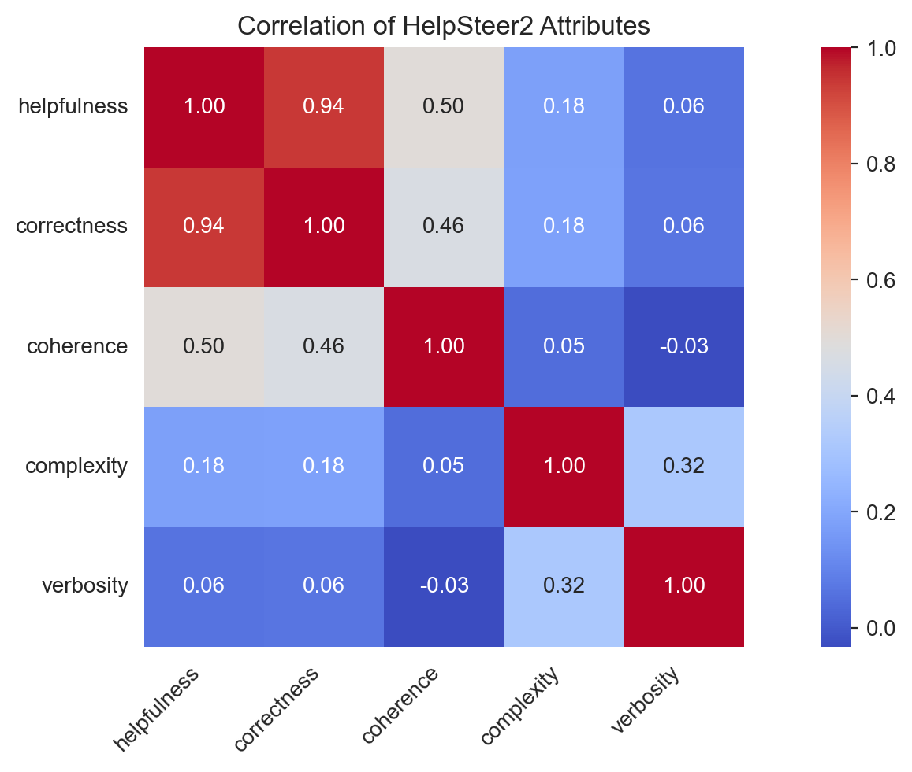
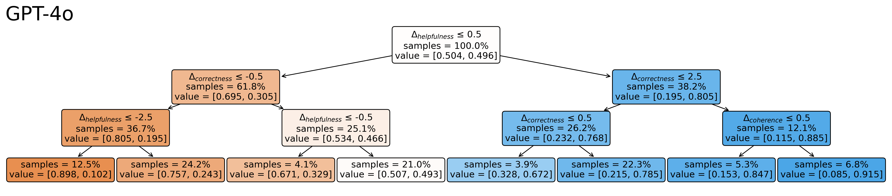
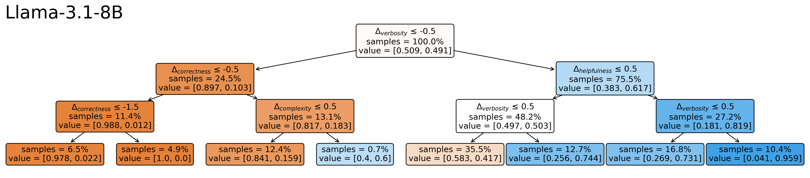

+ **Author** [Min Li](https://min-li.github.io/)
+ **Code**: https://github.com/RLHFlow/RLHF-Reward-Modeling/tree/main/decision_tree
+ **Models**:
  + [Decision-Tree-Reward-Gemma-2-27B](https://huggingface.co/RLHFlow/Decision-Tree-Reward-Gemma-2-27B)
  + [Decision-Tree-Reward-Llama-3.1-8B](https://huggingface.co/RLHFlow/Decision-Tree-Reward-Llama-3.1-8B)
+ **Tech Report**: To release soon
---
# Abstract

Modern Large Language Models (LLMs) are typically aligned with human preferences through Supervised Fine-Tuning (SFT) and Reinforcement Learning from Human Feedback (RLHF). While the goal is for aligned LLMs to exhibit human-like preferences, the internal decision-making mechanisms driving these preferences remain opaque. We present a novel interpretability framework that leverages decision trees to model and analyze how LLMs make preference judgments between response pairs to the same prompt.
Using the HelpSteer2 dataset with 5-dimensional human ratings for responses, we train decision trees to predict preferences across modern LLMs of different sizes and compare them with human preference structures. Our analysis reveals that leading models like GPT-4 and Claude-3.5 demonstrate decision-making patterns that closely mirror human preference architectures, while some other LLMs exhibit systematic divergences. A key finding shows that while humans exhibit minimal dependence on response verbosity in their judgments, certain LLMs strongly rely on verbosity in their preference judgments.
We extend this decision-tree framework to develop interpretable reward models that serve as human preference proxies. By fine-tuning Skywork-Reward-Llama-3.1-8B-v0.2 on HelpSteer2 to predict multi-objective ratings, we further fit a decision tree on top of it with human preference data. Our resulting model, Llama-3.1-8B-Decision-Tree-Reward, achieves state-of-the-art performance on RewardBench while providing explicit decision-making paths for its preferences. To facilitate further research in interpretable preference learning, we release our codebase, collected LLM preference data, and trained models.

# Motivation

The alignment of Large Language Models (LLMs) with human preferences has become a central challenge in AI development. While methods like RLHF have shown impressive results in making LLMs more helpful and aligned with human values, they often operate as black boxes, making it difficult to understand how these models actually make preference decisions between different responses.

This gap in interpretability raises several important questions: 
* How do LLMs make preference decisions between responses? 
* Do they follow similar decision-making patterns as humans when evaluating response quality? 
* Are there systematic differences in how various LLMs structure their preference judgments? Understanding these aspects is crucial not just for theoretical insight, but for practical alignment - we need to ensure that LLMs aren't just achieving high performance scores, but are actually making decisions in ways that align with human reasoning.

Our work addresses these questions by introducing decision trees as an interpretable lens for analyzing preference mechanisms. Decision trees offer a uniquely suitable framework for this analysis because they:
1. Provide explicit decision paths that show exactly how different factors combine to produce preference judgments.
2. Reveal the hierarchical importance of different quality dimensions.
3. Allow direct comparison between human and LLM decision-making structures in a human-interpretable and structured way.

This decision-tree perspective complements existing work on interpretable reward modeling by focusing not just on what factors matter, but on how these factors are systematically combined to make preference decisions in a structured way. Understanding these decision-making structures is essential for developing more reliably aligned LLMs and for detecting potential misalignment in existing models.

# LLM Preference Collection

To systematically analyze how LLMs make preference judgments between responses, we developed a prompt-based data collection framework to collect preference data from 30 LLMs. Further, we conduct a preliminary visualization analysis to briefly demonstrate the similarity between human preference and LLM preference.

## Data Collection Methodology

We designed a prompt template that standardizes the preference elicitation process across different LLMs. The template presents a conversation history and two possible responses, asking the LLM to indicate its preference with a clear "A is the better response" or "B is the better response" format. This structured approach enables consistent preference collection while accommodating multi-turn conversations:

```python
TEMPLATE = """Here is a conversation between a user and an AI assistant. Each user's message begins with "<|USER|>" and each assistant's message begins with "<|ASSISTANT|>".
Below is the conversation history and two possible responses. Please indicate which response you think is better and explain why.
State your preference by starting with either "A is the better response" or "B is the better response", then explain your reasoning.

### Conversation
{conversation}

### Response A
{response_1}

### Response B
{response_2}"""
```

Thanks to decent instruction-following capabilities in modern LLMs, this template reliably elicits clear preference judgments. Most models can consistently begin their responses with either "A is the better response" or "B is the better response," allowing us to extract unambiguous preference labels from the first character of each response. 

**Dataset:** We use the [HelpSteer2-Preference](https://arxiv.org/abs/2410.01257) dataset, which provides a diverse collection of response pairs with fine-grained human preference annotations. Our final dataset comprises 2,000 sampled pairs from the training set supplemented with the complete validation set of 448 pairs, offering a robust foundation for analyzing preference patterns. Each data point includes the full conversation history along with two potential responses, allowing us to examine how context influences preference decisions. This dataset contains 5 attributes, where each attribute has a 0-4 rating scale (i.e., scores are 0, 1, 2, 3, 4):
* `helpfulness`: Overall helpfulness of the response to the prompt.
* `correctness`: Inclusion of all pertinent facts without errors.
* `coherence`: Consistency and clarity of expression.
* `complexity`: Intellectual depth required to write response (i.e. whether the response can be written by anyone with basic language competency or requires deep domain expertise).
* `verbosity`: Amount of detail included in the response, relative to what is asked for in the prompt.
Here we show the the probability distribution of each attribute and the Pearson correlation between each pair of attributes.

<div align="center">

</div>

**Models:** We applied this methodology across a comprehensive set of 34 LLMs, encompassing both closed and open-source models. Our selection includes 9 closed-source models from industry leaders (OpenAI's GPT series, Anthropic's Claude series, and Google's Gemini series) and 25 open-source models (including model variants of the Llama-3, Mistral, Gemma, Qwen, and DeepSeek families). For closed-source models, we utilized their official APIs, while open-source model inference was conducted through the Together API platform. This diverse model selection enables us to examine preference patterns across different architectures, scales, and training approaches.
* **Open-Source models:** 
  * **Llama-3**:Llama-3-8B, Llama-3-70B, Llama-3.1-8B, Llama-3.1-70B, Llama-3.1-405B, , Llama-3.1-Nemotron-70B, Llama-3.2-3B, Llama-3.2-11B-Vision, Llama-3.2-90B-Vision, Llama-3.3-70B
  * **Mistral**: Mistral-7B-v0.1, Mistral-7B-v0.2, Mistral-7B-v0.3, Mixtral-8x7B, Mixtral-8x22B
  * **Gemma**: Gemma-2-9B, Llama-3.1-8B
  * **Qwen**: Qwen-2-72B, Qwen-2-VL-72B, Qwen-2.5-7B, Qwen-2.5-72B, Qwen-2.5-Coder-32B
  * **DeepSeek**: DeepSeek-V3, DeepSeek-LLM-67B
  * **Others**: SOLAR-10.7B
* **Closed-Source models:**
  * **OpenAI**: GPT-4-Turbo, GPT-4o, GPT-4o-mini
  * **Anthropic**: Claude-3.5-Haiku, Claude-3.5-Sonnet
  * **Google**: Gemini-1.0-Pro, Gemini-1.5-Flash, Gemini-1.5-Flash-8B, Gemini-1.5-Pro

## Position Bias Analysis

To ensure the validity of our collected preferences, we implemented careful controls for position bias - a well-documented phenomenon where LLMs may systematically favor options based on their presentation order rather than their content. Our methodology involves presenting each response pair twice, with positions swapped between presentations. We only retain preferences that remain consistent across both orderings, treating inconsistent cases as indicating no clear preference. For instance, if an LLM keeps outputting "A is the better response" before and after the position reordering of an example, we consider this as a preference inconsistency under position reordering. Here we show a plot of the preference consistency under position reordering, where the x-axis are models under our study and the y-axis is the preference consistency rate.


* Even if the highest consistency ratio is less than 80%, this does not necessarily mean the top models have significant position bias. Given that we do not offer a "tie" option in our prompt template, it is understandable that models may output inconsistent preferences for some examples with pairwise data of similar quality. 
* The relevant comparison among models can reveal the strength of position bias across models. For instance, there are 13 out of 34 models with a preference consistency ratio of less than 50% and 5 models are even less than 10%. For these models, we can confidently conclude that they have significant position bias.
* We remove the models with a preference consistency ratio of less than 20% from our following analysis.


## Preference Similarity Visualization

To provide an intuitive understanding of how different LLMs align with human preferences, we developed two complementary visualizations in the following. 

**Preference Agreement.** We utilize the agreement ratio to quantify preference agreements between models, defined mathematically as:
$$
D(A, B) = \frac{1}{N} \sum_{i=1}^{N} \mathbb{I}(A_i = B_i)
$$
where $A_i$ and $B_i$ represent the preference labels of the $i$-th data point, and $\mathbb{I}$ denotes the indicator function. This metric provides a normalized measure of disagreement between any two preference sources, with values closer to 0 indicating stronger disagreement and values closer to 1 indicating stronger agreement.

The resulting heatmap visualization of agreement ratio between all models reveals notable patterns in preference alignment:


The axis labels of models are ordered by their agreement with human preferences, offering immediate insight into which models most closely mirror human judgment. 

Note:
* `Human` here means the human annotators who label the preference data of the HelpSteer2-Preference dataset. Note that humans typically have diverse preferences and different LLMs are aligned with different human annotators. So this heatmap is just a reference based on the HelpSteer2-Preference dataset and does not imply any particular LLM is poorly aligned with human preferences.

**Preference Similarity Visualization with UMAP.** To further enhance our understanding of these relationships, we employed UMAP dimensionality reduction to project the preference patterns into a more interpretable 2D space:


This visualization reveals some interesting patterns:
- Model families like Mistral and Qwen exhibit strong within-family clustering, indicating shared preference architectures within each model family.
- Smaller-scale variants (8B and 3B) of Llama-3 demonstrate similar preference patterns to each other but diverge notably from their larger counterparts (70B and 405B).

While these visualizations provide valuable insights into the relationships between different models' preference mechanisms, they raise important questions about the underlying decision-making processes. The subsequent section addresses these questions through a detailed analysis using decision trees, offering a more interpretable perspective on how these models arrive at their preference judgments.


# Decision Tree Interpretation of LLM Preferences

Below, we show how to train a decision tree to interpret (and compare) different preference signals. 

The HelpSteer2-Preference dataset provides training and validation data in the format 
$$(x, a^1, a^2, r^1, r^2, y),$$
where:
- $x$: Conversation history except the last response from the assistant.
- $a^1$ and $a^2$: Two possible responses.
- $r^1$ and $r^2$: 5-dimensional reward vectors for $a^1$ and $a^2$, with dimensions corresponding to the 5 attributes of HelpSteer2. 
  - For instance, $r^1 = (r^1_{\text{helpfulness}}, r^1_{\text{correctness}}, r^1_{\text{coherence}}, r^1_{\text{complexity}}, r^1_{\text{verbosity}})$.
- $y$: Preference label, indicating whether $a^1$ is better than $a^2$, defined as $y = \mathbb{I}(a^1 \succ a^2)$, where $\mathbb{I}(\cdot)$ is the indicator function

We train a decision tree $f$ using a simple logistic-regression-style loss:

$$
\min_{f}  \; \mathbb{E}_{(x, a^1, a^2, r^1, r^2, y)} \Bigl[ 
    y \,\log\! \bigl(f(r^1 - r^2)\bigr)
    \;+\;
    (1 - y)\,\log\!\bigl(1 - f(r^1 - r^2)\bigr)
\Bigr],
$$
where the features are the differences $(r^1 - r^2)$ in the 5 attributes (helpfulness, correctness, coherence, complexity, verbosity).  The scalar output $f(\cdot)$ is then the predicted probability that $a^1$ is the better response.  

Notably, the preference label $y$ can be provided either by humans or by a particular LLM.  By swapping in different preference labels, we can train a separate decision tree for each “judge” (whether human or a specific LLM).  This allows us to compare how different judges structure their decision criteria.


**Tree Depth Selection.** Decision trees can grow arbitrarily deep, but increasing depth often leads to overfitting on training data.  We use a validation set to select an appropriate maximum depth and find that **depth 3** balances interpretability and predictive accuracy both for humans and most LLMs.  Consequently, **all** decision trees in our study are limited to depth 3.


## Decision Tree Visualization

To illustrate how the trees capture preference heuristics, we show below the **depth‐3 trees** fitted to **human** preference labels, to **GPT‐4o**’s preferences, and to **Llama‐3.1‐8B**’s preferences:






1. **Human and GPT-4o's Decision Trees**  
   Both trees exhibit remarkably similar structures, relying on `helpfulness` as their root decision node, followed by `correctness` in the second layer, and `coherence` in the third layer (with slightly different numeric thresholds). This hierarchical similarity - prioritizing overall helpfulness, then factual accuracy, and finally coherence - explains the high agreement rate between GPT-4o's and human preferences. The leaves show the probability distribution of favoring response $a^1$ vs. $a^2$ at each final decision point.

3. **Llama‐3.1‐8B's Decision Tree**  
   By contrast, Llama‐3.1‐8B places `verbosity` at the root, treating response length or detail level as the most decisive factor.  It also checks `correctness` and `complexity` in deeper nodes, but overall it departs significantly from the human‐like emphasis on helpfulness and correctness.  This suggests that Llama‐3.1‐8B systematically overvalues verbosity relative to what humans typically do.


## Feature Importance Analysis

To generalize from individual tree diagrams, we compute the standard “feature importances” for each tree across **all** models.  Concretely, we train 100 bootstrap replicas of each decision tree (randomly re‐ordering pairs and re‐splitting them) and average the Gini or logistic‐loss‐based importance measures.  This yields a **robust** measure of which attributes best predict that judge’s preferences.

The heatmap below shows these averaged importances, **sorted by** how closely each model’s preferences match **human** annotations.  


Key observations:

- **Models with a high agreement with human preferences** (e.g., GPT‐4, Claude‐3.5, Gemini‐1.5‐Pro) correspond to a **similar** feature‐usage pattern: `helpfulness` is the dominant attribute, followed by `correctness` and `coherence`.
- **Models with a low agreement with human preferences** (e.g., Llama-3.1-8B, Llama-3.2-3B) show a strong reliance on `verbosity` and relatively little weight on `helpfulness`, indicating a systematic bias toward longer responses that deviate from human preferences.

Overall, these tree visualizations and feature‐importance profiles provide **human‐readable insights** into what each model values most when choosing between two responses—and how well that aligns with our own human judgments.

# Decision Tree Reward Model

We next extend the decision‐tree framework to build an **interpretable reward model**—i.e., a stand‐in for human preferences that not only predicts which response is better but also explains *why* it makes those decisions.  Concretely, we start from a *multi‐objective* reward model and then fit a small decision tree on top, preserving alignment quality while revealing decision paths.

## Step 1: Multi‐Objective Reward Modeling
We begin with the open‐source **Skywork‐Reward‐Gemma‐2‐27B‐v0.2**—a high‐performing Bradley‐Terry reward model pretrained on open‐source preference data.  We adapt it to multi‐objective scoring by fine-tuning on HelpSteer2 ratings with the linear probing method (i.e., only fine-tuning the last linear layer of the model), following the same approach taken in the [ArmoRM](https://rlhflow.github.io/posts/2024-05-29-multi-objective-reward-modeling/) work.
1.  **Base Model**:  Skywork‐Reward‐Gemma‐2‐27B‐v0.2  
2.  **Training Data**:  HelpSteer2’s 5‐dimensional ratings (helpfulness, correctness, coherence, complexity, verbosity)
3.  **Objective**: Mean squared error (MSE) regression loss that predicts each rating dimension from the model’s final representation. 

## Step 2: Decision‐Tree‐Based Pairwise Preference Prediction

Once our multi-objective reward model can output a 5D rating vector $\hat{r} \in \mathbb{R}^5$, we use it to derive **pairwise preferences** between any two responses:

1. **Compute Rating Differences**.  For each pair $(a^1, a^2)$ in HelpSteer2, we feed both responses into the fine-tuned reward model to obtain
   $$
     \hat{r}^1 \;=\; (\hat{r}^1_{\text{helpfulness}}, \ldots, \hat{r}^1_{\text{verbosity}}), 
     \quad
     \hat{r}^2 \;=\; (\hat{r}^2_{\text{helpfulness}}, \ldots, \hat{r}^2_{\text{verbosity}}).
   $$
2. **Fit a Decision Tree**.  Finally, we train a depth‐3 decision tree $f(\hat{r_1} - \hat{r_2})$ to predict the pairwise preference label $y$ on the training set of HelpSteer2-Preference.  This matches the procedure in our earlier analysis of human‐labeled data, except that the multi-objective rewards come from **model**‐predicted rating ($\hat{r_1}, \hat{r_2}$) rather than human-annotated ratings ($r_1, r_2$).

## Decision Tree Visualization

Looking at the decision trees fitted to our multi-objective reward models:


* The Gemma-2-27B tree maintains the human-like structure we observed earlier, with helpfulness as the primary decision criterion. It creates careful distinctions around small helpfulness differences (±0.03) at the root, leading to highly confident predictions (>85%) when the differences become substantial.
* The Llama-3.1-8B tree, while also using helpfulness at its root, incorporates correctness, verbosity, and complexity in its deeper nodes. This mixed-attribute approach suggests the model has learned


## Evaluation on RewardBench
We evaluate our decision-tree-based reward models on [Reward-Bench](https://huggingface.co/spaces/allenai/reward-bench), a comprehensive benchmark designed to assess reward model performance across multiple dimensions of LLM alignment. Reward-Bench evaluates models on four key aspects: general chat quality, challenging chat scenarios, safety considerations, and reasoning capabilities.


Rank | Model | Base Model | Method | Overall Score | Chat | Chat Hard | Safety | Reasoning |
|:------|:------|:-----------|:-------|:------|:-----|:----------|:-------|:----------|
1 | [**Decision-Tree-Reward-Gemma-2-27B**](https://huggingface.co/RLHFlow/Decision-Tree-Reward-Gemma-2-27B) | Gemma-2-27B | Decision Tree | **95.3** | 96.9 | **91.4** | 93.7 | **99.1** |
2 | INF-QRM-Llama3.1-70B | Llama-3.1-70B | Sequence Classifier | 95.1 | 96.6 | 91.0 | 93.6 | **99.1** |
3 | QRM-Gemma-2-27B | Gemma-2-27B | Sequence Classifier | 94.4 | 96.6 | 90.1 | 92.7 | 98.3 |
4 | Skywork-Reward-Gemma-2-27B-v0.2 | Gemma-2-27B | Sequence Classifier | 94.3 | 96.1 | 89.9 | 93.0 | 98.1 |
5 | [**Decision-Tree-Reward-Llama-3.1-8B**](https://huggingface.co/RLHFlow/Decision-Tree-Reward-Llama-3.1-8B) | Llama-3.1-8B | Decision Tree | 94.3 | 96.9 | 89.3 | 92.9 | 98.5 |
6 | Llama-3.1-Nemotron-70B-Reward | Llama-3.1-70B | Custom Classifier | 94.1 | 97.5 | 85.7 | **95.1** | 98.1 |
7 | Skywork-Reward-Gemma-2-27B | Gemma-2-27B | Sequence Classifier | 93.8 | 95.8 | **91.4** | 91.9 | 96.1 |
8 | TextEval-Llama3.1-70B | Llama-3.1-70B | Generative | 93.5 | 94.1 | 90.1 | 93.2 | 96.4 |
9 | MetaMetrics-RM-v1.0 | - | Custom Classifier | 93.4 | **98.3** | 86.4 | 90.8 | 98.2 |
10 | Skywork-Critic-Llama-3.1-70B | Llama-3.1-70B | Generative | 93.3 | 96.6 | 87.9 | 93.1 | 95.5 |
11 | QRM-Llama3.1-8B-v2 | Llama-3.1-8B | Sequence Classifier | 93.1 | 96.4 | 86.8 | 92.6 | 96.8 |
12 | Skywork-Reward-Llama-3.1-8B-v0.2 | Llama-3.1-8B | Sequence Classifier | 93.1 | 94.7 | 88.4 | 92.7 | 96.7 |

Our evaluation reveals several key findings:

- The Gemma-2-27B version achieves state-of-the-art performance with a 95.3 overall score, leading in both reasoning tasks (99.1) and challenging chat scenarios (91.4).
- Both decision tree models show substantial improvements over their base Skywork versions, with relative error reductions of 26.3% for Gemma-2-27B and 17.4% for Llama-3.1-8B.
- The strong performance across all categories suggests that our decision-tree approach successfully captures nuanced preference patterns while maintaining interpretability.


# Conclusion

This paper introduces a novel framework for interpreting LLM preference mechanisms through decision trees, demonstrating that leading models like GPT-4o, Claude-3.5-Sonnet, and Llama-3.1-405B closely mirror human decision-making patterns while some open-source models show systematic biases. Building on these insights, we develop an interpretable reward modeling approach that achieves state-of-the-art performance on RewardBench while providing explicit decision paths. Our analysis reveals consistent preference patterns within model families, suggesting that architecture and training methodology significantly influence how models make decisions. By making preference mechanisms more transparent and interpretable, this work provides valuable tools for improving LLM alignment. To facilitate further research, we release our codebase, preference data, and trained models that combine strong performance with clear interpretability.
